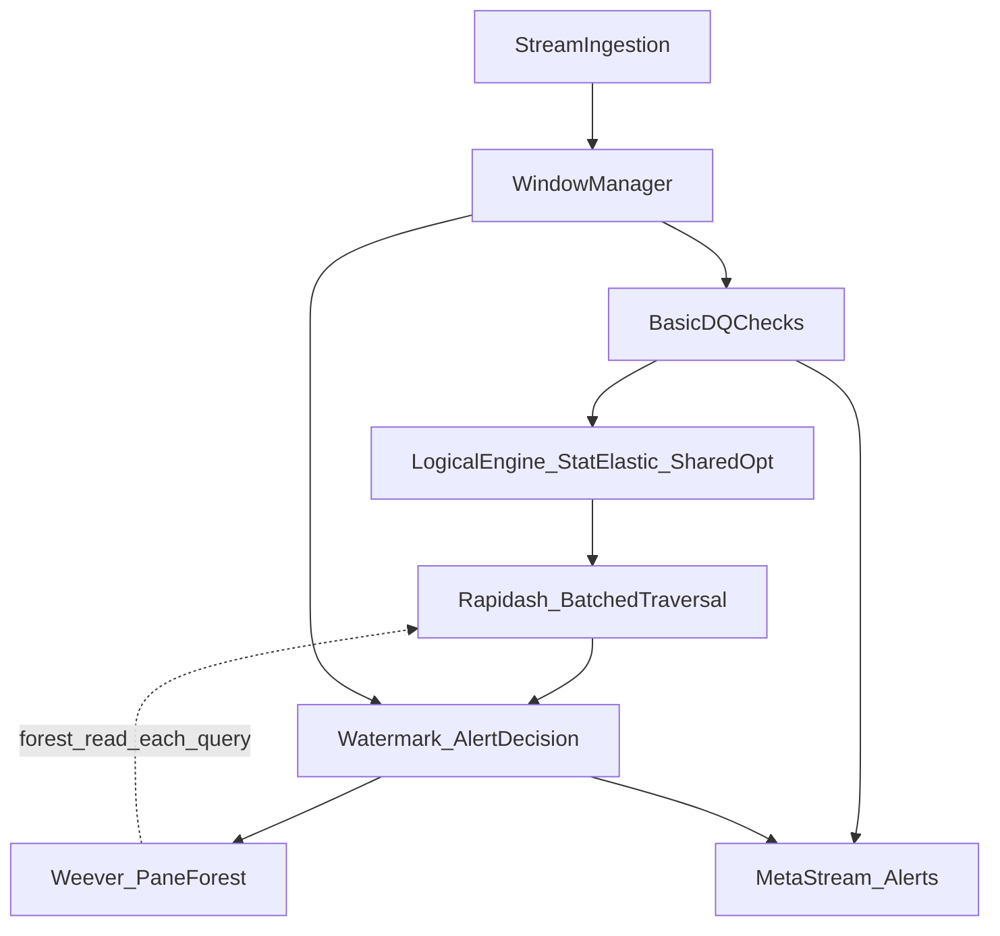

# AGENTS.md - Rules cho AI Assistant làm việc với WAVES Project

## Nguyên tắc vàng

### 1. Không bịa đặt, không tự ý làm trái lời
- HOÀN TOÀN GIAO TIẾP VÀ SUY NGHĨ BẰNG TIẾNG VIỆT
- **TUYỆT ĐỐI** không tự ý tạo code, giải thích, hoặc đề xuất mà không có cơ sở từ codebase, paper, hoặc tài liệu tham khảo
- Nếu không chắc chắn → hỏi ngược lại người dùng
- Không bao giờ nói "Tôi nghĩ" hoặc "Có lẽ" khi đưa ra quyết định kỹ thuật

### 2. Không tự giảm chất lượng code vì quá khó
- **NGHIÊM CẤM** tạo các bản "lite", "fallback", "simplified version", "workaround" để tránh phần khó
- Nếu gặp vấn đề khó → **ĐẶT CÂU HỎI NGƯỢC LẠI NGAY**:
  - "Phương pháp này có phù hợp với yêu cầu không?"
  - "Có cách nào tiếp cận khác không?"
  - "Có thể chia nhỏ vấn đề không?"

### 2b. Không overengineering
> Checklist có pseudocode rất chi tiết — nhưng implement phải **gọn gàng**, không phải lặp lại y chang pseudocode thành code.
- **Ưu tiên gọn**: `dict` / `list` / `set` trước; chỉ dùng class phức tạp khi thật sự cần.
- **Không dư thừa abstraction**: `if/else` rõ ràng hơn Strategy pattern; `dict` đủ thì không cần Registry.
- **Không build "có thể mở rộng"**: chỉ tổng quát hóa khi có **ít nhất 2 trường hợp dùng lại** trong code thực tế.
- **Interface nhỏ**: mỗi class / function chỉ làm **một việc**, không gộp 5 concerns.
- **Docstring vừa đủ**: giải thích **tại sao**, không lặp lại **what** (code đã là what).
- **Không thừa metadata**: không sinh class chỉ để đổi tên biến, không decorator khi không cần.

**Ví dụ đúng:**
```python
# ✅ Gọn: dict đủ cho AlertStateStore prototype
class AlertStateStore:
    def __init__(self): self._store = {}
    def put(self, alert): self._store[alert.alert_id] = alert
    def get(self, aid): return self._store.get(aid)

# ❌ Thừa: abstraction không cần thiết cho prototype
class AlertRepository(Protocol):
    @abstractmethod
    def save(self, entity: AlertEntity) -> Result[AlertId, RepositoryError]: ...
```

### 3. Mỗi hành động cần research kỹ lưỡng
- Trước khi implement bất cứ điều gì:
  1. Đọc kỹ source code của các base project
  2. Research phương pháp từ GitHub, paper thực tế
  3. Kiểm tra xem đã có ai làm chưa, làm tốt như nào
  4. Chỉ sau khi hiểu kỹ mới được thực hiện

### 4. Làm việc phải có cơ sở, không đoán mò
- Mọi quyết định kỹ thuật phải dựa trên:
  - Source code hiện có
  - Paper liên quan
  - GitHub repos / Stack Overflow
  - Best practices từ cộng đồng
- Khi đề xuất giải pháp → phải cite nguồn

### 5. Khi tác vụ thất bại hoặc thiếu tài nguyên — **nhắc user**, không tự ý làm bản rút gọn
- Nếu **không tải được dữ liệu** (URL lỗi, 403, timeout, file thiếu), **không** được tự thay bằng dữ liệu giả / subset tưởng tượng / pipeline "lite" mà **chưa** được user đồng ý bằng lời.
- Nếu **API, credential, quota, hoặc môi trường** chặn bước → **dừng và báo rõ** cho user (lỗi gì, cần họ làm gì), thay vì bypass im lặng.
- Nếu **build / test / cài dependency** lỗi → ghi log lỗi và **hỏi user** hoặc đề xuất bước sửa có xác nhận; **không** tự đổi sang thư viện khác hoặc bỏ bước kiểm thử để "cho xong".
- **NGHIÊM CẤM** dùng bản "lite / simplified / mock thay thế toàn bộ luồng" như một cách né lỗi — trùng tinh thần mục 2; chỉ được làm tối giản khi user **yêu cầu rõ** hoặc **chấp thuận** sau khi được thông báo.

---

## Các file quan trọng cần tuân thủ

| File / thư mục | Mục đích | Cập nhật khi |
|----------------|----------|--------------|
| `docs/context.md` | Hub tổng quan dự án (link tới design, base, code) | Khi đổi cấu trúc hoặc milestone |
| `docs/project.md` | Theo dõi tiến độ và thay đổi | **MỌI** update đều phải ghi |
| `docs/design/` | Tài liệu thiết kế trụ cột (WAVES) | Không đổi |
| `docs/base/` | Context các dự án có sẵn (tham chiếu) | Khi đổi base repo hoặc bổ sung paper |
| `docs/MASTER_AGENT_CHECKLIST.md` | Checklist tổng hợp cho agent | Tham chiếu khi nhận task |
| `AGENTS.md` | Rules cho agent (root hoặc docs) | Khi có rules mới |

---

## Quy tắc cụ thể

### Về việc đọc và hiểu code
```
1. Đọc README.md của mỗi base project TRƯỚC tiên
2. Đọc core source files (StreamDaQ.py, DCVerifier.java, Weever.java)
3. Hiểu flow dữ liệu trước khi đề xuất thay đổi
4. Lưu ý: Rapidash = Java, Stream DaQ = Python, Icewafl = Python
```

### Về việc implement
```
1. KHÔNG BAO GIỜ viết code mới mà không:
   - Hiểu rõ requirement
   - Đã research phương pháp
   - Có ví dụ từ codebase hoặc tài liệu

2. Khi cần implement DC checking:
   - Tham khảo DCVerifier.java của Rapidash
   - Tham khảo Weever.java cho incremental aspect

3. Khi cần Watermark:
   - Tham khảo watermark.pdf và watermark2.pdf
   - Xem cách Stream DaQ handle wait_for_late
```

### Về việc sửa đổi
```
1. KHÔNG XÓA file/folder khi chưa được phép bằng văn bản
2. Trước khi edit:
   - Backup nếu cần
   - Đọc kỹ file hiện tại
   - Hiểu context xung quanh
3. Sau khi edit:
   - Cập nhật project.md
   - Kiểm tra không break existing functionality
```

### Về việc báo cáo
```
1. Mỗi khi có update → cập nhật project.md ngay
2. Nếu xóa chức năng cũ → cũng phải ghi vào project.md
3. Khi hoàn thành milestone → tóm tắt vào project.md
```

---

## Cấu trúc project cần nhớ

```
/home/dtl/Documents/thesis/
│
├── [original]stream-DaQ/      # BẢN BACKUP Stream DaQ gốc (KHÔNG SỬA)
│   ├── pyproject.toml
│   ├── streamdaq/             # Source code gốc
│   │   ├── __init__.py
│   │   ├── StreamDaQ.py       # Core class
│   │   ├── DaQMeasures.py     # 50+ DQ measures
│   │   ├── Windows.py         # Windowing
│   │   └── ...
│   └── examples/
│
├── WAVES/                     # PROJECT CHÍNH (phát triển ở đây)
│   ├── pyproject.toml         # Dependencies (pyproject.toml!)
│   ├── README.md
│   ├── waves/                 # Source code WAVES
│   │   ├── __init__.py       # Main API
│   │   ├── watermark.py       # WatermarkHandler
│   │   ├── dc_checker.py     # DC Checker (port từ Rapidash)
│   │   └── wever.py           # LT-Tree (port từ Weever)
│   └── examples/
│
├── base/                      # Các base projects (tham khảo)
│   ├── stream-DaQ/           # Stream DaQ (working version)
│   ├── Rapidash/              # DC Checking (Java)
│   ├── Weever/                # Incremental Index (Java)
│   └── Icewafl/               # Benchmark Generator (Python)
│
├── docs/                      # Tài liệu trong repo
│   ├── base/                  # Context các dự án có sẵn (Stream DaQ, Rapidash, Weever, Icewafl, …)
│   ├── design/                # Toàn bộ tài liệu thiết kế WAVES — trụ cột cho dự án (kiến trúc, luồng, module, thực nghiệm; có thể export/sync từ new_docs)
│   ├── context.md             # Hub tổng quan dự án (nếu có)
│   ├── project.md             # Tiến độ (nếu có)
│   ├── MASTER_AGENT_CHECKLIST.md  # Checklist tổng hợp cho agent
│   └── AGENTS.md              # Bản trong docs/ nếu đồng bộ với root (tuỳ chọn)
│
└── paper/                     # Paper tham khảo
    ├── rapidash.pdf
    └── Icewalf.pdf
```

### `docs/base` và `docs/design`

- **`docs/base/`** — Chứa **context của các dự án có sẵn** (base repos, paper gốc): mục tiêu từng paper, file chính, cách dùng làm **tham chiếu** khi port hoặc đối chiếu hành vi.
- **`docs/design/`** — Chứa **toàn bộ tài liệu thiết kế** WAVES (kiến trúc, state/time, luồng, đặc tả module, thực nghiệm, v.v.): đây là **trụ cột** cho quyết định kỹ thuật và code.
- **`docs/MASTER_AGENT_CHECKLIST.md`** — Checklist end-to-end từ khởi tạo dự án đến bàn giao sản phẩm, thực nghiệm, paper và phản biện.

### Thứ tự ưu tiên đọc source

1. **[original]stream-DaQ/streamdaq/** - Stream DaQ gốc (không sửa)
2. **WAVES/waves/** - Code đang phát triển
3. **base/Rapidash/** - DC Checking reference
4. **base/Weever/** - Incremental indexing reference

---

## Quản lý Project & Dependencies

### Sử dụng Relative Path
```
✅ LUÔN LUÔN sử dụng relative path cho mọi file/thư mục
❌ TUYỆT ĐỐI KHÔNG hardcode absolute path

Ví dụ:
✅ "base/stream-DaQ/streamdaq/__init__.py"
✅ "../../docs/AGENTS.md"
❌ "/home/dtl/Documents/thesis/base/stream-DaQ/..."

Lý do: Project clone và push đồng thời trên Windows và Linux
→ Absolute path sẽ KHÔNG tương thích giữa 2 OS
```

### Môi trường Python: `.venv` + `pyproject.toml`
Dự án WAVES (và các package Python trong repo) dùng **`pyproject.toml`** làm nguồn dependency chính và **`venv` tại `.venv/`** (một virtual environment ở gốc repo hoặc trong từng package — thống nhất theo từng `pyproject.toml`).

```
✅ Tạo venv (một lần hoặc khi đổi máy):
   python -m venv .venv

✅ Kích hoạt:
   Windows:  .venv\Scripts\activate
   Linux/macOS: source .venv/bin/activate

✅ Cài package editable (trong thư mục có pyproject.toml):
   pip install -e .

✅ SỬ DỤNG pyproject.toml cho dependencies
❌ KHÔNG dùng requirements.txt làm nguồn chính (trừ khi có lý do đặc biệt và đã ghi trong docs)

❌ Không commit thư mục .venv/ (gitignore)

Cấu trúc pyproject.toml (ví dụ):
[project]
name = "project-name"
version = "0.1.0"
dependencies = [
    "pathway>=0.11.0",
    "pandas>=2.0.0",
]

[build-system]
requires = ["hatchling"]
build-backend = "hatchling.build"

Khi sync giữa máy: commit pyproject.toml (và lock file nếu team quyết định dùng); không commit .venv
```

### Cross-Platform Compatibility
```
✅ Kiểm tra path separator: dùng os.path.join() hoặc pathlib
✅ Kiểm tra OS: sys.platform hoặc platform.system()
✅ Tránh: hardcoded "/" hoặc "\\"

Ví dụ:
✅ pathlib.Path("base") / "stream-DaQ" / "streamdaq"
✅ os.path.join("base", "stream-DaQ", "streamdaq")
❌ "base/stream-DaQ/streamdaq" (có thể lỗi trên Windows)
```

---

## Workflow khi nhận task mới

```
1. Đọc task → Hiểu requirement
2. Check context.md, project.md → Hiểu current state
3. Tham chiếu MASTER_AGENT_CHECKLIST.md để xác định phase hiện tại
4. Research:
   - Đọc relevant base code
   - Tìm paper tham khảo
   - Tìm GitHub examples
5. Nếu khó → ĐẶT CÂU HỎI NGƯỢC LẠI
6. Nếu **blocked** (data, network, auth) → **thông báo user**, không tự làm lite
7. Nếu ok → Implement với full quality
8. Test và cập nhật project.md
```

---

## Kiến trúc WAVES — Tổng quan các module

### Luồng dữ liệu chính



**Ghi chú phụ thuộc**:
- **Rapidash** truy vấn **forest** do **Weever** duy trì (đọc snapshot hiện tại mỗi lần traversal)
- **Decision** nhận candidate từ Rapidash và watermark; sau đó cập nhật **Weever** (insert/pane)
- **Window Manager** cung cấp ranh giới cửa sổ cho watermark seal và cho Weever khi DROP pane
- **Tombstone** được duyệt tại lá trong Rapidash và giải phóng theo pane

### Các module chính (2.1–2.11)

| Module | ID | Chức năng chính |
|--------|----|-----------------|
| **StreamIngestion** | 2.1 | Nhận luồng thô (CSV/JSON/Kafka), gán EventTime/IngestionTime, chuẩn hóa schema |
| **WindowManager** | 2.2 | Gán bản ghi vào sliding window, duy trì buffer, tính delta insert/delete khi slide |
| **BasicDQChecks** | 2.3 | Completeness, validity, range — kiểm tra theo từng bản ghi |
| **LogicalEngine** | 2.4 | Statistical Context (EMA), Elastic Box Generator, điều phối thứ tự |
| **SharedRuleOptimizer** | 2.5 | Parse DC, greedy grouping, infinite padding, sinh ActiveBox metadata |
| **Rapidash** | 2.6 | KD-tree traversal, BatchedTraversal, Box Dropping, candidate violations |
| **Weever** | 2.7 | Pane-based forest, incremental insert/delete, DROP pane khi expire |
| **WatermarkAlert** | 2.8 | Alert State Store, provisional/final/retraction, watermark clock |
| **TombstoneFilter** | 2.9 | Lưu id đã retract, gắn vòng đời với pane, Bloom/Cuckoo filter |
| **HandleLateEvent** | 2.10 | Late data re-check, tombstone + retraction, upsert store |
| **AlertOutput** | 2.11 | Quality meta-stream + violation alert stream ra sink |

### Research Questions (RQ1–RQ4)

| RQ | Câu hỏi | Giả thuyết / cơ chế | Metrics chính | Module liên quan |
|----|---------|---------------------|---------------|------------------|
| RQ1 | Throughput vượt nested-loop truyền thống? | KD-Tree + pane-based forest, cắt tỉa không gian | Throughput, P99 latency, detection latency | Rapidash, Weever, Stream input, Window |
| RQ2 | EMA + Tombstone/Retraction giữ F1 khi drift + late data? | Elastic box; provisional vs final; retraction | Precision, Recall, F1 (sau retraction) | Logical Engine, Elastic Box, Watermark, Tombstone |
| RQ3 | Mở rộng khi 50–100 luật DC? | Shared indexing + batched multi-rule | Memory footprint, throughput | Shared Rule Optimizer, Rapidash batched |
| RQ4 | Trade-off siêu tham số? | α EMA, pane size, dimension cap | P99 / avg latency, F1, RAM | Elastic Box, Weever, Shared Rule Optimizer |

**Mỗi thí nghiệm phải map về đúng một RQ.**

---

## Baseline và Ablation

| Hệ thống | KD-Tree | Pane forest | EMA | Retraction | Mục đích |
|-----------|---------|-------------|-----|------------|----------|
| NL-Stream | ✗ | ✗ | ✗ | ✗ | O(N²), chứng minh nút thắt |
| Single-Tree-DaQ | ✓ | ✗ | ✗ | ✗ | Một cây lớn → fragment/spike |
| Static-Box-DaQ | ✓ | ✓ | ✗ | ✓ | Drift → false positive |
| WAVES-SingleRule | ✓ | ✓ | ✓ | ✓ | Tắt shared optimizer — nhiều cây rời |
| Buffer-Wait-DaQ | ✓ | ✓ | ✓ | ✗ | Detection latency cao (chờ watermark) |
| WAVES-Full | ✓ | ✓ | ✓ | ✓ | Cấu hình đầy đủ |

---

## DC Logic Benchmark (DC1–DC3)

| DC | Tên | Mô tả | Module |
|----|-----|-------|--------|
| DC1 | Fare–Distance Dominance | Hai xe quãng đường gần nhau → xe ngắn không fare cao bất thường | Rapidash/KD-Tree |
| DC2 | Context-Aware Duration Anomaly | Chuyến tương đồng không chênh duration quá lớn ngoài biên độ ngữ cảnh | EMA/Elastic Box |
| DC3 | Toll Route Anomaly | Cùng tuyến không lệch toll bất thường | Shared indexing / multi-rule |

---

## Metrics

### System Metrics
- **Throughput** (events/s)
- **P99 latency** (và avg nếu cần sensitivity)
- **Detection latency** (event time → khi alert "nhìn thấy")
- **Memory footprint** (RAM khi chạy dài / khi tăng số luật)

### Accuracy Metrics
- **Precision, Recall, F1** trên vi phạm logic (so ground truth)
- Quy tắc streaming có retraction: chấm trạng thái sau khi cộng/trừ retraction

### Sensitivity Analysis (E1–E3)
- **E1 — Pane size**: cửa sổ cố định; đo P99, avg latency
- **E2 — α (EMA)**: trên tập có drift; Precision, Recall, F1
- **E3 — Shared indexing dimension cap**: với ~100 luật DC; RAM, throughput

---

## Tham chiếu tài liệu thiết kế

| Tài liệu | Đường dẫn |
|----------|-----------|
| Đánh giá thực nghiệm, RQ, DC, baseline, metrics | `docs/design/thuc_nghiem.docx` |
| Problem statement / scope | `docs/design/problem_statement&scope.docx` |
| Kiến trúc hệ thống | `docs/design/system_architecture.docx` |
| Đặc tả module | `docs/design/module_specification.docx` |
| Interaction / data flow | `docs/design/interaction_flow_data_flow.docx` |
| State & time semantics | `docs/design/state_time_semantics.docx` |
| Câu hỏi phản biện | `docs/design/cauhoi.docx` |
| Stream DaQ | `docs/base/stream-DaQ_context.md` |
| Rapidash | `docs/base/Rapidash_context.md` |
| Weever | `docs/base/Weever_context.md` |
| Icewafl | `docs/base/Icewafl_context.md` |
| Checklist tổng hợp | `docs/MASTER_AGENT_CHECKLIST.md` |

---

## Những điều KHÔNG ĐƯỢC LÀM

1. ❌ Tự ý xóa file/folder khi chưa được phép bằng văn bản
2. ❌ Tạo "simplified version" / lite pipeline để tránh phần khó hoặc khi **data/API/env lỗi** mà user chưa đồng ý (xem mục **Nguyên tắc vàng §5**)
3. ❌ Nói "Có lẽ" khi đưa ra quyết định kỹ thuật
4. ❌ Implement mà không research trước
5. ❌ Quên cập nhật project.md khi có thay đổi
6. ❌ Che giấu lỗi tải dữ liệu, lỗi mạng, hoặc thiếu quyền bằng cách tự đổi sang dữ liệu giả / luồng rút gọn mà không báo user

---

## Những điều PHẢI LÀM

1. ✅ Đọc kỹ context trước khi trả lời
2. ✅ Research từ paper/code trước khi đề xuất
3. ✅ Hỏi ngược lại khi gặp vấn đề khó
4. ✅ **Báo rõ cho user** khi bị chặn: không tải được data, lỗi API, thiếu biến môi trường, v.v. — kèm gợi ý bước tiếp theo (không thay thế im lặng bằng bản lite)
5. ✅ Cập nhật project.md khi có thay đổi
6. ✅ Cite nguồn khi đề xuất giải pháp
7. ✅ Dùng **`.venv` + `pyproject.toml`** cho môi trường Python của dự án (khi làm việc với code Python)
8. ✅ Tham chiếu `MASTER_AGENT_CHECKLIST.md` để xác định phase và checklist trước khi thực hiện task

---

*Nhớ: "Không làm thì hỏi, không đoán, không bịa"*
