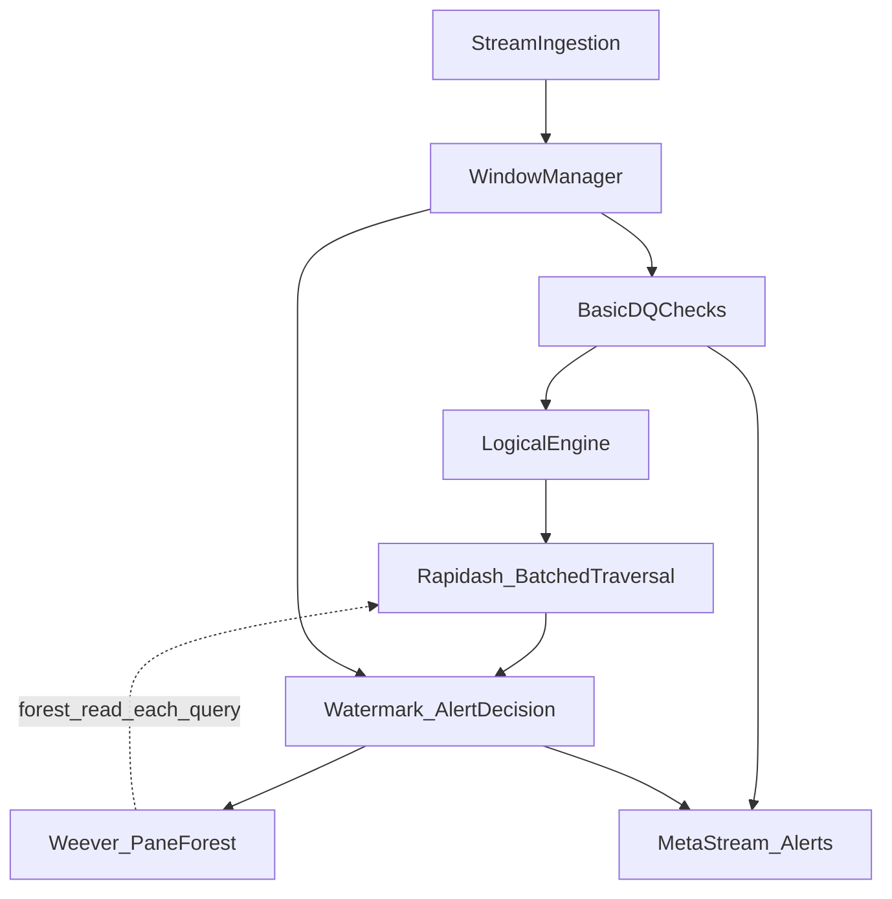

# WAVES — Master Agent Blueprint

> Checklist end-to-end từ khởi tạo dự án đến bàn giao sản phẩm, thực nghiệm, paper và phản biện.
> Bám [AGENTS.md](../AGENTS.md), [docs/base/](base/) và tài liệu này. Tick `- [ ]` → `- [x]` khi hoàn thành.
>
> **File này là nguồn đúng duy nhất cho implementation** — không phụ thuộc vào các file `.docx` bên ngoài.
> Mọi thiết kế chi tiết (công thức, pseudocode, cấu trúc dữ liệu) được ghi trực tiếp trong document.

---

## Mục lục

1. [Khởi tạo và quản trị dự án](#0-khởi-tạo-và-quản-trị-dự-án)
2. [Traceability: RQ → thiết kế → metric → baseline](#1-traceability-rq--thiết-kế--metric--baseline)
3. [Implementation theo kiến trúc / module](#2-implementation-theo-kiến-trúc--module)
4. [Dữ liệu, ground truth, pipeline benchmark](#3-dữ-liệu-ground-truth-pipeline-benchmark)
5. [Thực nghiệm, metric, baseline/ablation](#4-thực-nghiệm-metric-baselineablation)
6. [Hoàn thiện paper và phản biện](#5-hoàn-thiện-paper-và-phản-biện)
7. [Đóng dự án và tái hiện (reproducibility)](#6-đóng-dự-án-và-tái-hiện-reproducibility)
8. [Tham chiếu tài liệu](#7-tham-chiếu-tài-liệu-gốc)

**Module mới thêm sau khi kiểm tra tương tác:**
- [2.11b EventStore — SHARED](./#211b-eventstore--shared)
- [2.11c Pipeline Orchestrator](./#211c-pipeline-orchestrator)
- [2.13 Kiểm tra tương tác](./#213-kiểm-tra-tương-tác-giữa-các-module)

---

## 0. Khởi tạo và quản trị dự án

### 0.1 Cấu trúc thư mục WAVES (bắt buộc)

```
WAVES/                                    # Root — chạy pip install -e .
├── pyproject.toml
├── README.md
├── .gitignore                            # ignore: .venv/, __pycache__/, .pytest_cache/, *.pyc
├── waves/                                # Package chính
│   ├── __init__.py                       # __version__, exports chính
│   ├── py.typed
│   ├── ingestion/                         # Module 2.1
│   │   ├── __init__.py
│   │   ├── connector.py                  # ConnectorFactory, BaseConnector
│   │   ├── csv_connector.py               # CSVFileSource
│   │   ├── json_connector.py              # JSONLSource
│   │   ├── kafka_connector.py             # KafkaSource
│   │   ├── schema.py                     # Schema, DataEvent dataclass
│   │   └── dlq.py                        # DeadLetterQueue
│   ├── windowing/                        # Module 2.2
│   │   ├── __init__.py
│   │   ├── manager.py                    # WindowManager
│   │   ├── pane.py                       # Pane, PaneConfig (DUY NHẤT một định nghĩa)
│   │   └── watermark.py                  # WatermarkClock
│   ├── basic_dq/                         # Module 2.3
│   │   ├── __init__.py
│   │   ├── checker.py                    # BasicDQChecker
│   │   └── meta_stream.py               # QualityMetaStream
│   ├── logical_engine/                   # Module 2.4 (GỘP — không tách 3 file)
│   │   ├── __init__.py
│   │   └── engine.py                    # StatisticalContext + ElasticBoxGenerator + Coordinator
│   ├── optimizer/                         # Module 2.5
│   │   ├── __init__.py
│   │   ├── dc_parser.py                  # DCParser, parse DC text → Predicate list
│   │   └── grouper.py                   # GreedyRuleGrouper + InfinitePadding + ActiveBox
│   ├── rapidash/                         # Module 2.6
│   │   ├── __init__.py
│   │   ├── kdtree.py                    # KDTreeNode, bulk_load, range_query
│   │   ├── traversal.py                 # BatchedTraversal, BoxDropping
│   │   └── candidate.py                 # CandidateViolation
│   ├── weever/                          # Module 2.7
│   │   ├── __init__.py
│   │   └── pane_forest.py               # PaneForest (import Pane từ windowing.pane)
│   ├── decision/                        # Module 2.8
│   │   ├── __init__.py
│   │   ├── alert_store.py              # AlertStateStore
│   │   └── decision.py                 # Provisional + Final + Retraction
│   ├── tombstone/                       # Module 2.9
│   │   ├── __init__.py
│   │   └── filter.py                   # TombstoneManager (gắn vòng đời với pane)
│   ├── late_handler/                    # Module 2.10
│   │   ├── __init__.py
│   │   └── handler.py                  # HandleLateEvent
│   ├── output/                          # Module 2.11
│   │   ├── __init__.py
│   │   └── sink.py                      # AlertSink, MetaSink
│   └── store/                           # SHARED — event store dùng chung
│       ├── __init__.py
│       └── event_store.py              # EventStore (event_id → DataEvent + pane_id + window_id)
├── configs/
│   ├── dc_rules.json                    # DC1, DC2, DC3 rules
│   └── system.yaml                      # System-wide config
├── scripts/
│   ├── prepare_benchmark.py              # Prep NYC Taxi (B1–B4)
│   ├── inject_fraud.py                  # Fraud injection (DC1–DC3)
│   ├── inject_drift.py                  # Concept drift injection
│   ├── inject_late.py                   # Late/OoO injection
│   └── run_baseline.py                  # Baseline runner
├── examples/
│   ├── demo_stream_ingestion.py
│   ├── demo_windowing.py
│   ├── demo_basic_dq.py
│   ├── demo_logical_engine.py
│   ├── demo_rapidash.py
│   ├── demo_weever.py
│   ├── demo_watermark.py
│   ├── demo_late_handling.py
│   └── demo_end_to_end.py
└── tests/
    ├── unit/
    │   ├── test_ingestion.py
    │   ├── test_windowing.py
    │   ├── test_basic_dq.py
    │   ├── test_logical_engine.py
    │   ├── test_optimizer.py
    │   ├── test_rapidash.py
    │   ├── test_weever.py
    │   ├── test_decision.py
    │   ├── test_tombstone.py
    │   └── test_late_handler.py
    └── integration/
        ├── test_pipeline.py
        └── test_late_retraction.py
```

### 0.2 Hub tài liệu (bắt buộc)

- [ ] Có [docs/context.md](context.md): hub tổng quan.
- [ ] Có [docs/project.md](project.md): milestone, mọi thay đổi đáng kể.
- [ ] Mỗi lần merge milestone hoặc đổi kiến trúc: cập nhật `context.md` / `project.md`.

### 0.3 Môi trường Python

- [ ] Virtualenv tại `.venv/` (không commit).
- [ ] Dependencies qua `pyproject.toml`; cài editable: `pip install -e .` trong thư mục WAVES.
- [ ] Không hardcode absolute path; dùng `pathlib` / `os.path.join`.

### 0.4 Git và chất lượng kho mã

- [ ] `.gitignore` loại `.venv/`, `__pycache__/`, `.pytest_cache/`, `*.pyc`.
- [ ] Nhánh làm việc rõ ràng; tag release khi có bản đo benchmark/paper.
- [ ] Không tự ý xóa file/folder khi chưa được phép bằng văn bản.

### 0.5 Nguyên tắc vận hành agent

- [ ] Bị chặn: báo user, không thay bằng pipeline "lite"/mock toàn phần nếu chưa được đồng ý.
- [ ] Quyết định kỹ thuật có cơ sở: code, paper, hoặc tài liệu trong repo.

---

## 1. Traceability: RQ → thiết kế → metric → baseline

### 1.1 Bảng Research Questions

| RQ | Câu hỏi | Giả thuyết / cơ chế | Metrics | Module liên quan |
|----|----------|----------------------|---------|------------------|
| RQ1 | Throughput vượt nested-loop truyền thống? | KD-Tree + pane-based forest, cắt tỉa không gian | Throughput, P99 latency, detection latency | Rapidash, Weever, Ingestion, Window |
| RQ2 | EMA + Tombstone/Retraction giữ F1 khi drift + late? | Elastic box; provisional vs final; retraction | Precision, Recall, F1 (sau retraction) | Logical Engine, Elastic Box, Decision, Tombstone |
| RQ3 | Mở rộng khi 50–100 luật DC? | Shared indexing + batched multi-rule | Memory footprint, throughput | Shared Rule Optimizer, Rapidash batched |
| RQ4 | Trade-off siêu tham số? | α EMA, pane size, dimension cap | P99 / avg latency, F1, RAM | Elastic Box, Weever, Shared Rule Optimizer |

- [ ] Bảng trên đã được điền đủ trong báo cáo / readme thực nghiệm.
- [ ] Mỗi thí nghiệm map về đúng một RQ.

### 1.2 Luồng tài liệu → code → dữ liệu → paper

- [ ] File này là nguồn "đúng" cho hành vi mong đợi.
- [ ] Code WAVES comment hoặc doc trỏ tới mục tương ứng trong file này.

---

## 2. Implementation theo kiến trúc / module

### 2.0 Sơ đồ luồng dữ liệu



**Ghi chú phụ thuộc**:
- Rapidash đọc snapshot forest từ Weever (stateless về index).
- Decision nhận candidate từ Rapidash + watermark → cập nhật Weever (insert/pane).
- Window Manager cung cấp ranh giới cửa sổ cho watermark seal và cho Weever khi DROP pane.
- Tombstone được duyệt tại lá trong Rapidash và giải phóng theo pane.
- **TombstoneManager** được khởi tạo tại pipeline level, truyền vào Decision và Weever.

---

### 2.1 Stream Ingestion

#### 2.1.1 Cấu trúc dữ liệu

```python
from dataclasses import dataclass, field
from datetime import datetime
from typing import Optional, Dict, Any, List
import uuid

@dataclass
class DataEvent:
    """Standardized event sau khi ingestion."""
    event_id: str
    event_time: datetime
    ingestion_time: datetime
    window_id: Optional[str] = None
    pane_id: Optional[str] = None   # gán bởi WindowManager khi event được window
    partition_key: Optional[str] = None
    attributes: Dict[str, Any] = field(default_factory=dict)

@dataclass
class Schema:
    """Schema định nghĩa cách parse raw event."""
    event_time_field: str
    event_time_format: str = "%Y-%m-%d %H:%M:%S"  # timezone-aware parse
    ingestion_time_field: Optional[str] = None  # None = dùng NOW()
    ingestion_time_format: Optional[str] = None
    partition_key_field: Optional[str] = None
    field_types: Dict[str, type] = field(default_factory=dict)
    required_fields: List[str] = field(default_factory=list)
```

#### 2.1.2 Pseudocode

```
FUNCTION parse_and_normalize(raw_event, schema):
    1. event_time_str = raw_event[schema.event_time_field]
    2. event_time = parse_datetime(event_time_str, schema.event_time_format)
    3. IF schema.ingestion_time_field IS NOT None:
         ingestion_time = parse_datetime(raw_event[schema.ingestion_time_field],
                                        schema.ingestion_time_format)
       ELSE:
         ingestion_time = NOW()
    4. FOR field IN schema.required_fields:
         IF field NOT IN raw_event OR raw_event[field] IS NULL:
           → emit to DLQ(raw_event, f"missing:{field}")
           → RETURN None
    5. attributes = {}
       FOR field, expected_type IN schema.field_types:
         IF raw_event[field] IS NOT NULL:
           TRY: attributes[field] = expected_type(raw_event[field])
           EXCEPT: → emit to DLQ(raw_event, f"cast:{field}")
    6. partition_key = raw_event.get(schema.partition_key_field)
    7. RETURN DataEvent(
         event_id=uuid4(),
         event_time=event_time,
         ingestion_time=ingestion_time,
         partition_key=str(partition_key) if partition_key IS NOT None ELSE None,
         attributes=attributes
       )

FUNCTION parse_datetime(value, fmt):
    # Timezone-aware parse: chuẩn hóa về UTC-aware datetime
    # Ví dụ: "2024-01-15 10:30:00" → datetime(2024, 1, 15, 10, 30, 0, tzinfo=UTC)
    IF fmt IS NOT None:
         dt = datetime.strptime(value, fmt)
    ELSE:
         dt = datetime.fromisoformat(value)
    IF dt.tzinfo IS None:
         dt = dt.replace(tzinfo=timezone.utc)
    RETURN dt
```

#### 2.1.3 Connectors

```python
class BaseConnector(ABC):
    @abstractmethod
    def read(self) -> Iterable[DataEvent]: pass
    @abstractmethod
    def read_batch(self) -> List[DataEvent]: pass

class CSVFileSource(BaseConnector):
    def __init__(self, path, schema):
        self.path = path
        self.schema = schema
    def read(self):
        with open(self.path, newline='', encoding='utf-8') as f:
            for row in csv.DictReader(f):
                ev = parse_and_normalize(row, self.schema)
                if ev is not None:
                    yield ev
    def read_batch(self):
        return list(self.read())

class JSONLSource(BaseConnector):
    def __init__(self, path, schema):
        self.path = path
        self.schema = schema
    def read(self):
        with open(self.path, encoding='utf-8') as f:
            for line in f:
                if line.strip():
                    ev = parse_and_normalize(json.loads(line), self.schema)
                    if ev is not None:
                        yield ev
    def read_batch(self):
        return list(self.read())

class KafkaSource(BaseConnector):
    def __init__(self, bootstrap_servers, topic, group_id, schema):
        self.consumer = KafkaConsumer(topic, bootstrap_servers=bootstrap_servers,
                                     group_id=group_id, value_deserializer=lambda m: json.loads(m))
        self.schema = schema
    def read(self):
        for msg in self.consumer:
            ev = parse_and_normalize(msg.value, self.schema)
            if ev is not None:
                yield ev
    def read_batch(self):
        batch = []
        for msg in self.consumer:
            ev = parse_and_normalize(msg.value, self.schema)
            if ev is not None:
                batch.append(ev)
        return batch
```

#### 2.1.4 Checklist

- [ ] Đủ hai mốc thời gian và khóa bản ghi; lỗi parse không làm hỏng toàn pipeline.
- [ ] Backpressure / DLQ cho malformed events.
- [ ] Window gán theo **event-time**, không dùng ingestion-time.
- [ ] **Watermark**: connector gửi event về WatermarkClock khi nhận; ingestion không chặn luồng.

---

### 2.2 Window Manager

#### 2.2.1 Cấu trúc dữ liệu (MỘT ĐỊNH NGHĨA DUY NHẤT)

> **QUAN TRỌNG**: `Pane` chỉ được định nghĩa MỘT lần tại `waves/windowing/pane.py`.
> Tất cả module khác (Weever, Tombstone) import từ `windowing.pane`.

```python
from dataclasses import dataclass, field
from datetime import datetime, timedelta
from typing import Optional, Dict, List, Tuple

@dataclass
class WindowConfig:
    window_width: timedelta          # W
    slide_step: timedelta           # S  (S == W → tumbling)
    pane_size: Optional[timedelta] = None

@dataclass
class WindowBuffer:
    """Buffer cho một window — không merge với Pane."""
    window_id: str
    start_time: datetime
    end_time: datetime
    events: List[DataEvent] = field(default_factory=list)

@dataclass
class Pane:
    """
    Định nghĩa DUY NHẤT cho Pane.
    Dùng chung cho WindowManager (membership) VÀ Weever (KD-tree container).
    Import từ: waves.windowing.pane
    """
    pane_id: str
    start_time: datetime
    end_time: datetime
    window_id: str                  # Pane thuộc window nào
    # Weever fields (được set sau khi pane close)
    kdtree: Optional[Any] = None
    is_active: bool = True
    buffer: List[Tuple[Tuple[float, ...], str]] = field(default_factory=list)  # (point, event_id)
    size_hint: int = 0

@dataclass
class WindowedEvent:
    data_event: DataEvent
    window_id: str
    pane_id: Optional[str] = None

@dataclass
class WindowDelta:
    window_id: str
    inserts: List[DataEvent]
    deletes: List[DataEvent]
```

#### 2.2.2 Pseudocode

```
FUNCTION assign_window(event, config, buffers, watermark_clock):
    # buffers: Dict[str, WindowBuffer] — O(1) lookup
    pane_size = config.pane_size OR config.window_width
    pane_count = FLOOR(config.window_width / pane_size)
    earliest = FLOOR(event.event_time / config.slide_step) * config.slide_step

    FOR i FROM 0 TO pane_count:
        window_start = earliest - i * config.slide_step
        window_end = window_start + config.window_width
        IF window_start <= event.event_time < window_end:
            window_id = f"w_{to_ms(window_start)}_{to_ms(window_end)}"
            # Tính pane_id ngay trong assign_window — gán vào event
            pane_start = floor_ts(event.event_time, pane_size)
            pane_end = pane_start + pane_size
            event.pane_id = f"p_{to_ms(pane_start)}_{to_ms(pane_end)}"
            event.window_id = window_id
            IF watermark_clock >= window_start:
                RETURN [WindowedEvent(event, window_id, pane_id=event.pane_id)]
            ELSE:
                RETURN [WindowedEvent(event, window_id, pane_id=event.pane_id)]
    RETURN []

FUNCTION on_slide(current_watermark, config, buffers):
    # buffers: Dict[str, WindowBuffer] — lookup O(1) bằng window_id
    old_slide = current_watermark - config.slide_step
    delta_inserts, delta_deletes = [], []
    deltas = []  # list vì nhiều windows có thể close cùng lúc
    closing_windows = []  # các window vừa close — Decision cần finalize alerts

    FOR window_id, buffer IN buffers.items():
        IF buffer.end_time <= current_watermark:
            buffers.pop(window_id)  # O(1) pop
            delta_deletes.extend(buffer.events)
            closing_windows.append(window_id)   # ← Decision sẽ finalize these
            deltas.append(WindowDelta(buffer.window_id, [], delta_deletes))
            delta_deletes = []  # reset cho window tiếp theo
        ELSE:
            FOR event IN buffer.events:
                IF old_slide <= event.event_time < old_slide + config.slide_step:
                    delta_deletes.append(event)
                IF current_watermark <= event.event_time < current_watermark + config.slide_step:
                    delta_inserts.append(event)
            IF delta_inserts OR delta_deletes:
                deltas.append(WindowDelta(buffer.window_id, delta_inserts, delta_deletes))
                delta_inserts, delta_deletes = [], []  # reset

    RETURN (deltas, closing_windows)  # tuple: deltas cho Weever, closing_windows cho Decision
```

#### 2.2.4 Checklist

- [ ] Quy tắc membership: `t ≤ event_time(R) < t+W`.
- [ ] `buffers` là `Dict` (O(1) lookup), không phải `List` (O(n)).
- [ ] Late / OoO: vẫn route đúng window; chốt alert theo watermark + `wait_for_late`.
- [ ] `on_slide` trả về tuple `(deltas, closing_windows)`.
- [ ] `event_store.put(event)` được gọi sau khi gán `pane_id` và `window_id`.

---

### 2.3 Basic DQ Checks

#### 2.3.1 Cấu trúc dữ liệu

```python
from dataclasses import dataclass, field
from enum import Enum
from typing import Dict, Any, Optional

class DQResult(Enum):
    PASS = "pass"
    FAIL = "fail"
    SKIP = "skip"

@dataclass
class CheckResult:
    rule_id: str
    result: DQResult
    event_id: str
    window_id: Optional[str]
    detail: Dict[str, Any]

@dataclass
class WindowMeta:
    window_id: str
    total_count: int = 0
    fail_counts: Dict[str, int] = field(default_factory=dict)  # rule_id → count
    pass_rate: float = 1.0

@dataclass
class BasicDQRule:
    rule_id: str
    rule_type: str   # "null", "type", "range", "regex"
    field: str
    params: Dict[str, Any] = field(default_factory=dict)
```

#### 2.3.2 Pseudocode

```
FUNCTION check_event(event, rules, counters):
    # counters: Dict[rule_id → int] — track fail count trực tiếp, O(1) mỗi event
    results = []
    FOR rule IN rules:
        value = event.attributes.get(rule.field)
        IF rule.rule_type == "null":
            IF value IS NULL:
                counters[rule.rule_id] = counters.get(rule.rule_id, 0) + 1
                results.append(CheckResult(rule.rule_id, DQResult.FAIL,
                                          event.event_id, event.window_id,
                                          {"field": rule.field, "value": None}))
            ELSE:
                results.append(CheckResult(rule.rule_id, DQResult.PASS, ...))
        ELIF rule.rule_type == "type":
            IF value IS NOT NULL AND NOT isinstance(value, rule.params["type"]):
                counters[rule.rule_id] = counters.get(rule.rule_id, 0) + 1
                results.append(CheckResult(...DQResult.FAIL...))
            ELSE:
                results.append(CheckResult(...DQResult.PASS...))
        ELIF rule.rule_type == "range":
            mn, mx = rule.params.get("min"), rule.params.get("max")
            IF value IS NOT NULL AND ((mn is not None and value < mn) or
                                      (mx is not None and value > mx)):
                counters[rule.rule_id] = counters.get(rule.rule_id, 0) + 1
                results.append(CheckResult(...DQResult.FAIL...))
            ELSE:
                results.append(CheckResult(...DQResult.PASS...))
        ELIF rule.rule_type == "regex":
            IF value IS NOT NULL AND NOT re.match(rule.params["pattern"], str(value)):
                counters[rule.rule_id] = counters.get(rule.rule_id, 0) + 1
                results.append(CheckResult(...DQResult.FAIL...))
            ELSE:
                results.append(CheckResult(...DQResult.PASS...))
    RETURN results

FUNCTION build_window_meta(window_id, total_count, counters):
    # Counters đã được update trong check_event → O(1) build
    pass_rate = 1.0 - SUM(counters.values()) / max(total_count, 1)
    RETURN WindowMeta(window_id=window_id, total_count=total_count,
                     fail_counts=dict(counters), pass_rate=pass_rate)
```

#### 2.3.3 Checklist

- [ ] Đủ completeness / validity / range trước DC.
- [ ] Counters O(1) — không scan lại kết quả O(n*m).

---

### 2.4 Logical Engine

> GỘP thành 1 file `engine.py` — không tách 3 file. Toàn bộ logic ~100 dòng.

#### 2.4.1 Cấu trúc dữ liệu

```python
from dataclasses import dataclass, field
from typing import Dict, Tuple, List

@dataclass
class StatisticalState:
    mean: float = 0.0
    variance: float = 0.0
    sample_count: int = 0
    last_update_ms: int = 0  # để kiểm tra stale state

    @property
    def std(self) -> float:
        import math
        return math.sqrt(max(self.variance, 1e-9))

@dataclass
class ElasticBox:
    dc_id: str
    group_id: str
    # Padded bounds cho Rapidash: chỉ cần dim → (lo, hi)
    # KHÔNG có column_to_dim — đó là internal của optimizer
    padded_bounds: Dict[int, Tuple[float, float]]
    # dim_map cần thiết cho Rapidash.extract_point
    dim_map: Dict[str, int]  # col → dim_index (từ optimizer)
    delta: float
    sigma: float
    created_at_ms: int = 0

# ActiveBox định nghĩa tại optimizer/grouper.py
```

#### 2.4.2 Công thức (từ `module_specification.docx` mục 5.5)

```
EMA mean:     μ_t = α · x_t + (1 - α) · μ_{t-1}

EMA variance (theo design doc — dùng μ_{t-1} để tránh look-ahead bias):
    σ²_t = (1 − α) · σ²_{t-1} + α · (x_t − μ_{t-1})²

Elastic Δ:    Δ = clamp(k · σ, Δ_min, Δ_max)
              bound = static_bound ± Δ

Key: Dùng μ_{t-1} (chưa cập nhật) cho variance, không phải μ_t.
```

#### 2.4.3 Pseudocode

```
FUNCTION update_statistical_state(event, state_dict, rule_group,
                                  feature_field, alpha, partition_key=None):
    # partition_key = PULocationID hoặc VehicleType nếu cần partition riêng
    key = (partition_key, rule_group, feature_field) if partition_key else (rule_group, feature_field)
    state = state_dict.get(key, StatisticalState())
    value = event.attributes.get(feature_field)
    IF value IS NULL: RETURN

    # Design doc mục 5.5: dùng μ_{t-1} cho variance để tránh look-ahead bias
    d = value - state.mean  # dùng mean cũ (chưa cập nhật)
    state.mean = alpha * value + (1 - alpha) * state.mean
    # Variance: dùng mean cũ để tính
    state.variance = (1 - alpha) * state.variance + alpha * d**2
    state.sample_count += 1
    state.last_update_ms = now_ms()
    state_dict[key] = state
    RETURN state

FUNCTION build_elastic_box(dc_id, rule_group, static_bounds, state_dict,
                            k, delta_min, delta_max, dim_map, warmup=50):
    dimensions = {}
    total_delta = 0.0
    FOR col, (s_lo, s_hi) IN static_bounds.items():
        state = state_dict.get((rule_group, col))
        IF state IS NOT None AND state.sample_count >= warmup:
            sigma = state.std
            delta = clamp(k * sigma, delta_min, delta_max)
            dim = dim_map[col]  # col → dim_index từ optimizer
            dimensions[dim] = (s_lo - delta, s_hi + delta)
            total_delta += delta
        ELSE:
            dim = dim_map[col]
            dimensions[dim] = (s_lo - delta_min, s_hi + delta_min)
            total_delta += delta_min

    RETURN ElasticBox(
        dc_id=dc_id, group_id=rule_group,
        padded_bounds=dimensions,
        dim_map=dim_map,  # cần cho Rapidash.extract_point
        delta=total_delta,
        sigma=sum(state.std for col in static_bounds
                 if state_dict.get((rule_group, col)) is not None),
        created_at_ms=now_ms()
    )

FUNCTION process_event_engine(event, state_dict, dc_rules, config):
    # Bước 1: update stats TRƯỚC
    FOR dc IN dc_rules:
        FOR col IN dc.feature_columns:
            # Hỗ trợ partition_key nếu config yêu cầu
            partition = event.partition_key if getattr(config, 'partition_by', None) else None
            update_statistical_state(event, state_dict, dc.rule_group, col,
                                    config.alpha, partition_key=partition)

    # Bước 2: generate boxes SAU
    boxes = []
    FOR dc IN dc_rules:
        box = build_elastic_box(dc.dc_id, dc.rule_group, dc.static_bounds,
                                state_dict, config.k, config.delta_min,
                                config.delta_max, dc.dim_map, config.warmup)
        boxes.append(box)

    RETURN boxes
```

#### 2.4.4 Edge Cases và Warm-up (từ design doc mục 5.5)

Design doc nêu 5 edge cases bắt buộc phải xử lý:

```
EDGE CASE 1 — Zero variance:
    Khi mọi xe chạy gần cùng vận tốc → σ = 0 → hộp co về quá nhỏ.
    → LUÔN ÁP DỤNG Δ_min > 0 để bảo vệ.

EDGE CASE 2 — Drift đột ngột / Spike:
    Một outlier có thể làm Δ nở bất thường.
    → Dùng clamp Δ_max; có thể thêm rule bỏ qua điểm cực đoan trước khi update EMA.

EDGE CASE 3 — Cold start:
    Hệ thống mới chưa đủ mẫu.
    → Warm-up period: trước khi đủ số mẫu, fallback về static box gốc.
    → Cấu hình: warmup = 50 (số mẫu tối thiểu).

EDGE CASE 4 — Thiếu feature context:
    Event không có trường dùng cho EMA.
    → Fallback về box tĩnh gần nhất; KHÔNG suy diễn bừa.

EDGE CASE 5 — State stale theo partition:
    Các nhóm ít dữ liệu → μ và σ có thể quá cũ.
    → Cần timeout để reset state hoặc đánh dấu degraded mode.
    → timestamp cập nhật cuối cùng trong StatisticalState để kiểm tra.
```

**Partition key isolation** (design doc mục 5.5):
```
Design doc: nên giữ state theo key = (rule_group, feature_name)
hoặc key = (partition_key, rule_id, feature_name) nếu cần context riêng cho từng nhóm.
Ví dụ: key = ("dc2", "trip_duration") cho toàn cục
       key = ("NYC", "dc2", "trip_duration") cho partition theo zone

Key construction trong update_statistical_state:
    key = (partition_key, rule_group, feature_field) if partition_key else (rule_group, feature_field)
```

#### 2.4.5 Checklist

- [ ] Công thức EMA đúng (dùng μ_{t-1} cho variance).
- [ ] Cold start: fallback về static box khi chưa đủ warm-up samples.
- [ ] Zero variance: luôn áp dụng Δ_min > 0.
- [ ] Key state: `(partition_key, rule_group, feature)` hoặc `(rule_group, feature)`.
- [ ] Stale state: kiểm tra timestamp, reset khi timeout.
- [ ] Thứ tự: update stats → generate box → emit.

---

### 2.5 Shared Rule Optimizer

#### 2.5.1 Cấu trúc dữ liệu

```python
from dataclasses import dataclass, field
from typing import Dict, List, Tuple
from enum import Enum
import math

class PredicateType(Enum):
    EQUAL = "EQUAL"
    LESS = "LESS"
    LESS_EQUAL = "LESS_EQUAL"
    GREATER = "GREATER"
    GREATER_EQUAL = "GREATER_EQUAL"

@dataclass
class Predicate:
    """
    Parse từ DC text, tách prefix s./t. khỏi column name.
    Ví dụ: "trip_distance_s" → left_col="trip_distance", side="s"
            "fare_amount" const → left_col="fare_amount", side=None, is_const=True
    """
    left_col: str       # column name (không có prefix)
    left_side: str      # "s" hoặc "t"
    operator: PredicateType
    right_col: str      # column name hoặc constant string
    right_side: str     # "s" hoặc "t" (None nếu constant)
    is_constant: bool   # True nếu right_col là literal
    constant_value: float = None  # parsed value nếu is_constant=True

@dataclass
class DenialConstraint:
    dc_id: str
    rule_group: str
    predicates: List[Predicate]
    description: str = ""
    # Thông tin cho optimizer
    equality_cols: List[str] = field(default_factory=list)
    inequality_cols: List[str] = field(default_factory=list)
    static_bounds: Dict[str, Tuple[float, float]] = field(default_factory=dict)
    dim_map: Dict[str, int] = field(default_factory=dict)  # col → dim_index

    @property
    def feature_columns(self) -> List[str]:
        """Tất cả columns dùng trong DC (equality + inequality)."""
        return self.equality_cols + self.inequality_cols

@dataclass
class ActiveBox:
    """
    Box metadata truyền xuống Rapidash.
    Design doc (mục 5.6): phải có feature_mapping để Rapidash không parse lại DC trên hot path.
    """
    box_id: str
    dc_id: str
    group_id: str
    padded_bounds: Dict[int, Tuple[float, float]]  # dim → (lo, hi) đã padded
    feature_mapping: Dict[str, int] = field(default_factory=dict)  # col → dim_index (từ optimizer)
    priority: int = 0
    version: int = 0
```

#### 2.5.2 DC Parsing

```
ALGORITHM parse_dc_json(dc_json):
# Parse JSON → DenialConstraint, tách s./t. prefix

1. predicates = []
2. FOR pred_json IN dc_json["predicates"]:
       left_raw = pred_json["left_col"]
       right_raw = pred_json["right_col"]
       # Tách prefix
       left_col, left_side = strip_side_prefix(left_raw)  # "trip_distance_s" → ("trip_distance", "s")
       IF right_raw.startswith("s.") or right_raw.startswith("t."):
           right_col, right_side = strip_side_prefix(right_raw)
           is_constant = False
       ELSE:
           # Constant number
           right_col = right_raw
           right_side = None
           is_constant = True
       predicates.append(Predicate(
           left_col=left_col, left_side=left_side,
           operator=PredicateType(pred_json["operator"]),
           right_col=right_col, right_side=right_side,
           is_constant=is_constant,
           constant_value=float(right_raw) if is_constant else None
       ))

3. dc = DenialConstraint(dc_id=dc_json["dc_id"],
                          rule_group=dc_json["rule_group"],
                          predicates=predicates,
                          description=dc_json.get("description", ""))
4. dc.equality_cols = [p.left_col for p in predicates if p.operator == EQUAL]
5. dc.inequality_cols = [p.left_col for p in predicates if p.operator != EQUAL]
6. dc.static_bounds = infer_static_bounds(dc.inequality_cols)
   # Xác định static bounds từ:
   #   - File config/dc_rules.json (ưu tiên), HOẶC
   #   - Tính từ NYC Taxi dataset (thuc_nghiem docx mục 3.1)
   #   - Hoặc để trống {} → dùng Δ_min cho mọi chiều (an toàn)
7. RETURN dc

FUNCTION strip_side_prefix(raw):
    IF raw.endswith("_s"):
        RETURN raw[:-2], "s"
    ELIF raw.endswith("_t"):
        RETURN raw[:-2], "t"
    ELSE:
        RETURN raw, None
```

**Ví dụ JSON:**

```json
{
  "dc_rules": [
    {
      "dc_id": "DC1",
      "rule_group": "fare_distance",
      "description": "Fare–Distance Dominance",
      "predicates": [
        {"left_col": "trip_distance_s", "operator": "EQUAL", "right_col": "trip_distance_t"},
        {"left_col": "fare_amount_s", "operator": "LESS_EQUAL", "right_col": "fare_amount_t"},
        {"left_col": "trip_distance_s", "operator": "LESS", "right_col": "trip_distance_t"}
      ]
    }
  ]
}
```

#### 2.5.3 Greedy Grouping + Infinite Padding

```
ALGORITHM GreedyRuleGrouper(dcs, k_max):
# Output: List[GroupMetadata] + assign dim_map cho từng DC

1. groups = []
2. FOR dc IN dcs:
       sig = tuple(sorted(dc.equality_cols))
       merged = False
       FOR g IN groups WHERE g.equality_signature == sig:
           new_dim_count = g.dimension_count + len(dc.inequality_cols)
           IF new_dim_count <= k_max:
               g.dc_ids.append(dc.dc_id)
               g.dimension_count = new_dim_count
               FOR col IN dc.inequality_cols:
                   IF col NOT IN g.column_to_dim:
                       g.column_to_dim[col] = len(g.column_to_dim)
               merged = True
               BREAK
       IF NOT merged:
           dim_map = {}
           dim_idx = 0
           FOR col IN dc.equality_cols:
               dim_map[col] = dim_idx
               dim_idx += 1
           FOR col IN dc.inequality_cols:
               dim_map[col] = dim_idx
               dim_idx += 1
           groups.append(GroupMetadata(
               group_id=f"g_{len(groups)}",
               dc_ids=[dc.dc_id],
               equality_signature=sig,
               dimension_count=dim_idx,
               column_to_dim=dim_map
           ))
       dc.dim_map = g.column_to_dim  # assign sau khi dc vào nhóm

3. RETURN groups

ALGORITHM build_active_boxes(dcs, groups):
# Tạo ActiveBox cho mỗi DC với infinite padding

1. boxes = []
2. FOR dc IN dcs:
       g = groups WHERE g.group_id == dc.rule_group  # tìm group
       padded_bounds = {}
       FOR dim, col IN g.column_to_dim.items():
           IF col IN dc.static_bounds:
               padded_bounds[dim] = dc.static_bounds[col]
           ELSE:
               padded_bounds[dim] = (-math.inf, math.inf)  # infinite padding
       boxes.append(ActiveBox(
           box_id=f"box_{dc.dc_id}_{g.group_id}",
           dc_id=dc.dc_id,
           group_id=g.group_id,
           padded_bounds=padded_bounds,
           feature_mapping=g.column_to_dim,  # Design doc: feature_mapping cho Rapidash
           priority=0, version=0
       ))
3. RETURN boxes
```

#### 2.5.4 Checklist

- [ ] DC parser tách `s.`/`t.` prefix đúng.
- [ ] Greedy grouping tách nhóm khi vượt `k_max`.
- [ ] Infinite padding cho các chiều không dùng trong DC.
- [ ] `ActiveBox` KHÔNG có `column_to_dim` — đó là internal.

---

### 2.6 Rapidash Layer

#### 2.6.1 Cấu trúc dữ liệu

```python
from dataclasses import dataclass, field
from typing import List, Dict, Tuple, Optional

@dataclass
class KDTreeNode:
    point: Tuple[float, ...]
    point_id: str
    partition_dim: int
    split_value: float
    # Bounding box của region con — CẦN CHO BOX DROPPING ĐÚNG
    left_lo: Tuple[float, ...]    # Lower bound của left region
    left_hi: Tuple[float, ...]    # Upper bound của left region
    right_lo: Tuple[float, ...]   # Lower bound của right region
    right_hi: Tuple[float, ...]    # Upper bound của right region
    left: Optional['KDTreeNode'] = None
    right: Optional['KDTreeNode'] = None
    is_leaf: bool = False
    leaf_points: List[Tuple[Tuple[float, ...], str]] = field(default_factory=list)

@dataclass
class CandidateViolation:
    """
    Candidate violation. Lưu TẤT CẢ event_id liên quan để retract đúng.
    """
    dc_id: str
    window_id: str
    pane_id: str
    query_id: str              # event_id của query point (s)
    matched_ids: List[str]     # TẤT CẢ event_id trong box thỏa mãn DC (t)
    box_id: str
    timestamp_ms: int
    detail: Dict = field(default_factory=dict)

@dataclass
class BatchedTraversalResult:
    candidates: List[CandidateViolation]
    visited_nodes: int
    pruned_nodes: int
```

> **S2 / M3 note**: `HashPartition` đã xóa — không dùng trong pane-based architecture.
> Pane-based forest thay thế hash partition. Mỗi pane = một KD-Tree riêng.

#### 2.6.2 KD-Tree Bulk Load

```
ALGORITHM KDTreeBulkLoad(points, dim_count, lo_bounds, hi_bounds):
# Xây dựng KD-Tree với bounding box per node

INPUT:
  points: List[(point_tuple, event_id)]
  dim_count: int
  lo_bounds: Tuple[float] — global lower bounds mỗi chiều
  hi_bounds: Tuple[float] — global upper bounds mỗi chiều

OUTPUT: KDTreeNode (root)

1. IF points IS EMPTY: RETURN None
2. IF len(points) <= LEAF_SIZE:
       RETURN KDTreeNode(
           point=points[0][0], point_id=points[0][1],
           partition_dim=0, split_value=points[0][0][0],
           is_leaf=True, leaf_points=points,
           left_lo=lo_bounds, left_hi=hi_bounds,
           right_lo=lo_bounds, right_hi=hi_bounds
       )
3. dim = argmax_range(points, dim_count)
4. sort points by dim
5. median = len(points) // 2
6. split_val = points[median][0][dim]
7. left_pts = points[:median], right_pts = points[median+1:]
8. # Compute bounding boxes cho con
   left_lo = lo_bounds, left_hi = list(hi_bounds); left_hi[dim] = split_val
   right_lo = list(lo_bounds); right_lo[dim] = split_val; right_hi = hi_bounds
9. RETURN KDTreeNode(
       point=points[median][0], point_id=points[median][1],
       partition_dim=dim, split_value=split_val,
       left_lo=tuple(left_lo), left_hi=tuple(left_hi),
       right_lo=tuple(right_lo), right_hi=tuple(right_hi),
       left=KDTreeBulkLoad(left_pts, dim_count, lo_bounds, tuple(left_hi)),
       right=KDTreeBulkLoad(right_pts, dim_count, tuple(right_lo), hi_bounds)
   )

FUNCTION argmax_range(points, dim_count):
    ranges = {}
    FOR dim IN range(dim_count):
        vals = [p[0][dim] for p in points]
        ranges[dim] = max(vals) - min(vals)
    RETURN max(ranges, key=lambda d: ranges[d])
```

#### 2.6.3 Batched Traversal + Box Dropping

> **Pattern từ design doc** (`interaction_flow_data_flow.docx`, Pseudo-code A):
> Dùng `SplitRegion` + `Intersects` thay vì so sánh bounding box per-dimension.
> `ActiveBoxes` rỗng → prune toàn bộ nhánh.

```
ALGORITHM BatchedTraversal(query_point, query_id, active_boxes,
                           forest, tombstone_mgr, event_store):

INPUT:
  query_point: Tuple[float]  — điểm s (event đến)
  query_id: str              — event_id của s
  active_boxes: List[ActiveBox]
  forest: PaneForest         — từ Weever
  tombstone_mgr: TombstoneManager
  event_store: EventStore    — SHARED

OUTPUT: BatchedTraversalResult

1. IF active_boxes IS EMPTY: RETURN BatchedTraversalResult([], 0, 0)
2. candidates = []; visited = 0; pruned = 0
3. FOR box IN active_boxes:
       trees = forest.get_roots(box.group_id)
       FOR tree_root IN trees:
           hits, v, p = traverse_node(tree_root, query_point, query_id,
                                     box, tombstone_mgr, event_store)
           candidates.extend(hits)
           visited += v; pruned += p
4. RETURN BatchedTraversalResult(candidates, visited, pruned)

ALGORITHM traverse_node(node, query_point, query_id, box, tombstone_mgr, event_store):
# Recursive traversal với Box Dropping
# Pattern đúng: dùng SplitRegion + Intersects (design doc)

1. IF node IS None: RETURN ([], 1, 0)

2. IF node.is_leaf:
       matched = []
       FOR (pt, pt_id) IN node.leaf_points:
           IF pt_id == query_id: CONTINUE
           pane_id_t = event_store.get_pane_id(pt_id)
           IF tombstone_mgr.contains(pt_id, pane_id=pane_id_t):
               CONTINUE
           IF point_in_box(pt, box):
               matched.append(pt_id)
       IF matched:
           pane_id = event_store.get_pane_id(query_id)
           window_id = event_store.get_window_id(query_id)
           RETURN ([CandidateViolation(
               dc_id=box.dc_id, window_id=window_id,
               pane_id=pane_id,
               query_id=query_id, matched_ids=matched,
               box_id=box.box_id, timestamp_ms=now_ms()
           )], 1, 0)
       RETURN ([], 1, 0)

3. # BOX DROPPING — dùng SplitRegion + Intersects (design doc pattern)
   # LeftRegion, RightRegion đã được pre-computed trong KDTreeNode
   left_intersects = Intersects(box, node.left_lo, node.left_hi)
   right_intersects = Intersects(box, node.right_lo, node.right_hi)

   IF NOT left_intersects AND NOT right_intersects:
       RETURN ([], 1, 1)  # Pruned

4. # Kiểm tra query_point (s) trong box
   candidate_on_path = None
   IF point_in_box(query_point, box):
       pane_id_q = event_store.get_pane_id(query_id)
       IF NOT tombstone_mgr.contains(query_id, pane_id=pane_id_q):
           candidate_on_path = CandidateViolation(
               dc_id=box.dc_id, window_id=event_store.get_window_id(query_id),
               pane_id=pane_id_q, query_id=query_id,
               matched_ids=[],  # sẽ collect sau
               box_id=box.box_id, timestamp_ms=now_ms()
           )

5. # Duyệt cả hai nhánh (QUAN TRỌNG: không early-return khi query_point trong box)
   hits = []
   IF left_intersects:
       h, v, p = traverse_node(node.left, query_point, query_id, box, tombstone_mgr, event_store)
       hits.extend(h); visited += v; pruned += p
   IF right_intersects:
       h, v, p = traverse_node(node.right, query_point, query_id, box, tombstone_mgr, event_store)
       hits.extend(h); visited += v; pruned += p

   # Nếu có candidate trên đường đi, collect matched từ cả 2 nhánh
   IF candidate_on_path IS NOT None:
       candidate_on_path.matched_ids = [pt_id for (pt_id, _) in
           get_all_leaf_points_below(node)]
       hits.insert(0, candidate_on_path)

   RETURN (hits, visited, pruned)

ALGORITHM Intersects(box, region_lo, region_hi) -> bool:
# Kiểm tra box có giao với region [region_lo, region_hi] không
# Dùng: max(lo1, lo2) <= min(hi1, hi2) cho mọi chiều
FOR dim IN range(len(region_lo)):
    box_lo, box_hi = box.padded_bounds.get(dim, (-math.inf, math.inf))
    overlap_lo = max(region_lo[dim], box_lo)
    overlap_hi = min(region_hi[dim], box_hi)
    IF overlap_lo > overlap_hi:
        RETURN False
RETURN True

ALGORITHM point_in_box(point, box):
    FOR dim, (lo, hi) IN box.padded_bounds.items():
        val = point[dim]
        IF lo > val OR val > hi:
            RETURN False
    RETURN True

# Ghi chú design doc:
# - ActiveBoxes rỗng → điều kiện prune MẠNH NHẤT: toàn bộ nhánh dừng ngay
# - TombstoneFilter tại lá bỏ ghost/retracted data O(1)
# - Box Dropping tại nút trong: hộp không giao cắt → rụng khỏi nhánh
# - Candidate violation chỉ được sinh TẠI NÚT LÁ
```

#### 2.6.4 Checklist

- [ ] `KDTreeNode` lưu bounding box per node cho box dropping đúng.
- [ ] `box_intersects_region` so sánh với **bounding box**, không phải split value.
- [ ] `matched_ids` lưu TẤT CẢ điểm tìm được trong box (để retract đúng).
- [ ] Rapidash stateless: chỉ đọc forest từ Weever.

---

### 2.7 Weever — Pane-based Forest

> `Pane` được import từ `waves.windowing.pane` — chỉ có MỘT định nghĩa.

```python
from waves.windowing.pane import Pane
from dataclasses import dataclass, field
from typing import Dict, List, Optional

@dataclass
class PaneForest:
    """Forest chứa tất cả pane trees. pan_es là flat list — pane_id là key duy nhất."""
    panes: List[Pane] = field(default_factory=list)  # flat list, not by group
    panes_by_id: Dict[str, Pane] = field(default_factory=dict)  # O(1) lookup by pane_id
    # TombstoneManager được truyền vào từ pipeline level
    tombstone_mgr = None  # set bởi pipeline

    def get_roots(self, group_id: str) -> List[Optional[Any]]:
        """Lấy KD-tree roots của tất cả panes."""
        return [p.kdtree for p in self.panes if p.kdtree is not None]

    def get_pane_by_id(self, pane_id: str) -> Optional[Pane]:
        """O(1) lookup by pane_id."""
        return self.panes_by_id.get(pane_id)

    def find_or_create_pane(self, event: DataEvent, config: WindowConfig) -> Pane:
        """
        Tìm pane hiện tại cho event, tạo mới nếu chưa có.
        Key: pane_id = f"p_{to_ms(pane_start)}_{to_ms(pane_end)}"
        pane_id là unique key — không cần group_key.
        """
        pane_size = config.pane_size or config.window_width
        pane_start = floor_ts(event.event_time, pane_size)
        pane_end = pane_start + pane_size
        pane_id = f"p_{to_ms(pane_start)}_{to_ms(pane_end)}"

        if pane_id in self.panes_by_id:
            return self.panes_by_id[pane_id]

        new_pane = Pane(
            pane_id=pane_id,
            start_time=pane_start,
            end_time=pane_end,
            window_id=event.window_id or "",
            is_active=True,
            buffer=[],
            size_hint=0
        )
        self.panes.append(new_pane)
        self.panes_by_id[pane_id] = new_pane
        return new_pane

    def drop_pane(self, pane_id: str):
        """O(1) drop — xóa khỏi list và dict."""
        self.panes = [p for p in self.panes if p.pane_id != pane_id]
        self.panes_by_id.pop(pane_id, None)
        if self.tombstone_mgr:
            self.tombstone_mgr.drop_pane(pane_id)
```

```
ALGORITHM pane_insert(event, pane_forest, config, dim_map):
    pane = pane_forest.find_or_create_pane(event, config)
    point = extract_point(event, dim_map)  # Tuple[float] theo dim_map
    IF pane.is_active:
        pane.buffer.append((point, event.event_id))
        pane.size_hint += 1
    ELSE:
        # Late event → xử lý qua LateHandler
        LOG(f"Late event {event.event_id} inserted into closed pane {pane.pane_id}")
        RETURN  # Late events được xử lý qua HandleLateEvent

ALGORITHM pane_close(pane, pane_forest, dim_count, lo_bounds, hi_bounds):
    IF pane.buffer:
        pane.kdtree = KDTreeBulkLoad(pane.buffer, dim_count, lo_bounds, hi_bounds)
        pane.buffer = []
        pane.is_active = False
    # TombstoneManager tạo filter mới cho pane
    IF pane_forest.tombstone_mgr:
        pane_forest.tombstone_mgr.create_pane(pane.pane_id)

ALGORITHM window_slide(pane_forest, watermark_clock, dim_count, lo_bounds, hi_bounds):
    expired = [p.pane_id for p in pane_forest.panes
               if p.end_time <= watermark_clock]
    for pid in expired:
        pane = pane_forest.panes_by_id.get(pid)
        if pane:
            pane_close(pane, pane_forest, dim_count, lo_bounds, hi_bounds)
        pane_forest.drop_pane(pid)  # O(1)
```

#### 2.7.1 Checklist

- [ ] `Pane` import từ `windowing.pane` — chỉ có MỘT định nghĩa.
- [ ] DROP pane là O(1); tombstone filter drop cùng lúc.

---

### 2.8 Watermark / Alert Decision Layer

#### 2.8.1 Cấu trúc dữ liệu

```python
from dataclasses import dataclass, field
from datetime import datetime
from enum import Enum
from typing import Dict, List, Optional

class AlertStatus(Enum):
    PROVISIONAL = "provisional"
    FINAL = "final"
    RETRACTED = "retracted"

@dataclass
class AlertRecord:
    alert_id: str
    dc_id: str
    window_id: str
    pane_id: str
    status: AlertStatus
    # TẤT CẢ event_id liên quan — bao gồm query (s) VÀ matched (t)
    all_event_ids: List[str] = field(default_factory=list)
    created_at: datetime = None
    finalized_at: Optional[datetime] = None
    retracted_at: Optional[datetime] = None

@dataclass
class WatermarkConfig:
    watermark_policy: str = "event_time"  # "event_time" hoặc "ingestion_time"
    wait_for_late: int = 300  # seconds
    watermark_advance_interval: int = 1   # seconds giữa mỗi lần advance
    alert_ttl: int = 3600    # seconds — sau finalize bao lâu thì xóa

@dataclass
class AlertDecision:
    decision_type: str          # "provisional", "final", "retraction"
    alert: AlertRecord
    tombstone_ids: List[str] = field(default_factory=list)  # cần tombstone
```

#### 2.8.2 AlertStateStore Interface ĐẦY ĐỦ

```python
class AlertStateStore:
    """
    KV store: alert_id → AlertRecord.
    Implement = Dict[str, AlertRecord] hoặc RocksDB tùy scale.
    Design doc (mục 5.4): "key = window_id, rule_id, entity_id hoặc alert_id".
    """

    def __init__(self):
        self._store: Dict[str, AlertRecord] = {}
        self._by_window: Dict[str, List[str]] = {}  # window_id → [alert_id]
        # Design doc: AlertStateStore.find_by_event_id (cho HandleLateEvent)
        self._by_event: Dict[str, List[str]] = {}   # event_id → [alert_id]

    def put(self, alert: AlertRecord):
        self._store[alert.alert_id] = alert
        if alert.window_id not in self._by_window:
            self._by_window[alert.window_id] = []
        if alert.alert_id not in self._by_window[alert.window_id]:
            self._by_window[alert.window_id].append(alert.alert_id)
        # Index by event_id (cần cho HandleLateEvent)
        for eid in alert.all_event_ids:
            if eid not in self._by_event:
                self._by_event[eid] = []
            if alert.alert_id not in self._by_event[eid]:
                self._by_event[eid].append(alert.alert_id)

    def get(self, alert_id: str) -> Optional[AlertRecord]:
        return self._store.get(alert_id)

    def get_by_window(self, window_id: str) -> List[AlertRecord]:
        alert_ids = self._by_window.get(window_id, [])
        return [self._store[a] for a in alert_ids if a in self._store]

    def get_by_window_and_dc(self, window_id: str, dc_id: str) -> List[AlertRecord]:
        return [a for a in self.get_by_window(window_id) if a.dc_id == dc_id]

    def get_by_event_id(self, event_id: str) -> List[AlertRecord]:
        """Design doc requirement: tìm alert liên quan đến event (cho HandleLateEvent).
        Chỉ trả về PROVISIONAL alerts."""
        alert_ids = self._by_event.get(event_id, [])
        return [self._store[a] for a in alert_ids if a in self._store]

    def delete(self, alert_id: str):
        if alert_id in self._store:
            alert = self._store[alert_id]
            self._by_window.get(alert.window_id, []).remove(alert_id)
            for eid in alert.all_event_ids:
                self._by_event.get(eid, []).remove(alert_id)
            del self._store[alert_id]

    def retract(self, alert_id: str) -> Optional[AlertRecord]:
        """Xóa alert khỏi store khi retract. Lưu alert_id vào metrics log riêng."""
        if alert_id not in self._store:
            return None
        alert = self._store[alert_id]
        alert.status = AlertStatus.RETRACTED
        alert.retracted_at = NOW()
        self.delete(alert_id)  # xóa khỏi index
        # Ghi vào metrics log (không cần query nữa)
        metrics_log_append("retraction", alert)
        return alert
```

#### 2.8.3 Pseudocode (Design doc: watermark không chặn luồng chính)

```
# Design doc (state_time_semantics):
# Watermark KHÔNG phải là thứ chặn luồng để chờ đủ dữ liệu.
# Nó đóng vai trò: (1) đóng sổ, (2) dọn rác, (3) chuyển provisional → final.
# Luồng chính vẫn phát provisional alert ngay khi phát hiện.
# Watermark chỉ advance khi có dữ liệu mới, không block.

FUNCTION process_candidate(candidate, alert_store, tombstone_mgr, config):
    # candidate.matched_ids chứa TẤT CẢ event_ids trong violation
    all_ids = [candidate.query_id] + candidate.matched_ids
    alert_id = f"alert_{candidate.dc_id}_{candidate.window_id}_{candidate.query_id}"

    # Chỉ skip nếu alert đang ở PROVISIONAL/FINAL trong store
    # (RETRACTED alerts đã bị xóa khỏi store → không skip)
    existing = alert_store.get(alert_id)
    IF existing IS NOT None AND existing.status != AlertStatus.RETRACTED:
        RETURN []

    alert = AlertRecord(
        alert_id=alert_id,
        dc_id=candidate.dc_id,
        window_id=candidate.window_id,
        pane_id=candidate.pane_id,
        status=AlertStatus.PROVISIONAL,
        all_event_ids=all_ids,
        created_at=NOW()
    )
    alert_store.put(alert)
    RETURN [AlertDecision("provisional", alert)]

FUNCTION finalize_window(window_id, alert_store, watermark_clock, config):
    decisions = []
    alerts = alert_store.get_by_window(window_id)
    FOR alert IN alerts:
        IF alert.status == AlertStatus.PROVISIONAL:
            alert.status = AlertStatus.FINAL
            alert.finalized_at = NOW()
            alert_store.put(alert)
            decisions.append(AlertDecision("final", alert))
    RETURN decisions

FUNCTION retract_alert(alert_id, alert_store, tombstone_mgr):
    alert = alert_store.get(alert_id)
    IF alert IS None OR alert.status == AlertStatus.RETRACTED:
        RETURN []
    # Xóa khỏi store — không keep RETRACTED alerts trong store
    tombstone_ids = list(alert.all_event_ids)
    FOR event_id IN tombstone_ids:
        tombstone_mgr.add(event_id, alert.pane_id)
    # Retract = xóa + ghi metrics. Lưu ý: alert đã bị xóa khỏi store sau retract()
    retracted = alert_store.retract(alert_id)
    RETURN [AlertDecision("retraction", retracted, tombstone_ids)]

FUNCTION cleanup_expired(alert_store, ttl_seconds):
    now = NOW()
    FOR alert_id IN list(alert_store._store.keys()):
        alert = alert_store.get(alert_id)
        IF alert.status == AlertStatus.FINAL AND \
           (now - alert.finalized_at).total_seconds() > ttl_seconds:
            alert_store.delete(alert_id)
```

#### 2.8.4 Checklist

- [ ] `AlertRecord.all_event_ids` lưu TẤT CẢ ids — query (s) + matched (t).
- [ ] Retraction tombstone tất cả ids, không thiếu.
- [ ] `AlertStateStore` có đủ 5 method: `get`, `put`, `get_by_window`, `get_by_window_and_dc`, `get_by_event_id`.
- [ ] `AlertDecision` chứa `alert` (có thể là None khi retracted).

---

### 2.9 Tombstone Filter

> **QUAN TRỌNG**: `TombstoneManager` có owner rõ ràng.

```python
from typing import Set, Optional, Dict
from dataclasses import dataclass, field

class TombstoneFilter:
    """O(1) lookup filter gắn với một pane."""
    def __init__(self):
        self._ids: Set[bytes] = set()
    def add(self, event_id: str):
        self._ids.add(event_id.encode())
    def contains(self, event_id: str) -> bool:
        return event_id.encode() in self._ids
    def clear(self):
        self._ids.clear()

class TombstoneManager:
    """
    Owner: Pipeline level.
    Khởi tạo MỘT lần tại pipeline setup, truyền vào Decision và Weever.
    KHÔNG có module nào tự tạo TombstoneManager.
    """
    def __init__(self):
        self._filters: Dict[str, TombstoneFilter] = {}  # pane_id → filter

    def create_pane(self, pane_id: str):
        """Được gọi bởi Weever khi pane close."""
        self._filters[pane_id] = TombstoneFilter()

    def add(self, event_id: str, pane_id: str):
        f = self._filters.get(pane_id)
        if f:
            f.add(event_id)

    def contains(self, event_id: str, pane_id: str) -> bool:
        f = self._filters.get(pane_id)
        if f is None:
            return False
        return f.contains(event_id)

    def drop_pane(self, pane_id: str):
        """Được gọi bởi Weever khi pane drop. O(1)."""
        if pane_id in self._filters:
            self._filters[pane_id].clear()
            del self._filters[pane_id]
```

**Pipeline initialization (thứ tự đúng):**
```
1. Pipeline tạo TombstoneManager()
2. Pipeline truyền TombstoneManager vào Weever.pane_forest.tombstone_mgr
3. Pipeline truyền TombstoneManager vào Decision layer
4. Pipeline truyền TombstoneManager vào LateHandler
```

#### 2.9.1 Checklist

- [ ] `TombstoneManager` có owner rõ: khởi tạo tại pipeline level.
- [ ] `drop_pane` là O(1): xóa reference + clear filter.
- [ ] Lookup O(1).

---

### 2.10 Late Data Handling

#### 2.10.1 Pseudocode

```
ALGORITHM HandleLateEvent(late_event, alert_store, tombstone_mgr,
                          pane_forest, logical_engine, config, dc_rules,
                          event_store):
    window_id = late_event.window_id
    pane_id = late_event.pane_id  # đã được gán bởi WindowManager

    # Bước 1: kiểm tra ngưỡng lateness
    window_end = parse_window_end(window_id)  # extract từ "w_{start}_{end}"
    IF watermark_clock > window_end + config.wait_for_late:
        log(f"Late event {late_event.event_id} out of threshold, DROP")
        RETURN []

    # Bước 2: tìm alert liên quan đến event này (design doc: find_by_event_id)
    # Design doc (interaction_flow_data_flow.docx): OldAlerts <- AlertStateStore.find_by_event_id(LateEvent.id)
    alerts = alert_store.get_by_event_id(late_event.event_id)
    decisions = []

    # Bước 3: retract TẤT CẢ alerts liên quan
    FOR alert IN alerts:
        IF alert.status == AlertStatus.FINAL:
            CONTINUE  # đã final thì không retract được
        # Duyệt các DC liên quan để kiểm tra invalidate
        FOR dc IN dc_rules WHERE dc.dc_id == alert.dc_id:
            IF late_event_does_invalidate(alert, late_event, dc, event_store):
                decision = retract_alert(alert.alert_id, alert_store, tombstone_mgr)
                decisions.extend(decision)

    # Bước 4: insert late event vào Weever
    pane_insert(late_event, pane_forest, config, dim_map)

    # Bước 5: re-check nếu cần
    # Late event có thể tạo violation mới → chạy lại logical → rapidash → decision
    boxes = process_event_engine(late_event, state_dict, dc_rules, config)
    FOR box IN boxes:
        # chỉ check với pane của late_event
        pane_obj = pane_forest.get_pane_by_id(pane_id)
        IF pane_obj IS None OR pane_obj.kdtree IS None:
            CONTINUE
        result = traverse_node(pane_obj.kdtree,
                              extract_point(late_event, box.dim_map),
                              late_event.event_id, box, tombstone_mgr, event_store)
        FOR candidate IN result.candidates:
            d = process_candidate(candidate, alert_store, tombstone_mgr, config)
            decisions.extend(d)

    RETURN decisions

FUNCTION late_event_does_invalidate(alert: AlertRecord, late_event: DataEvent, dc: DenialConstraint, event_store: EventStore) -> bool:
    # Kiểm tra late_event có chứng minh alert cũ sai không.
    # DC format: NOT (P1 AND P2 AND ... AND Pn)
    # Alert cũ bị sai nếu late_event thỏa mãn TẤT CẢ predicates.
    #
    # Ví dụ DC1: NOT (trip_distance_s == trip_distance_t
    #                          AND fare_amount_s <= fare_amount_t
    #                          AND trip_distance_s < trip_distance_t)
    # Alert sai khi: late_event (t) thỏa mãn TẤT CẢ 3 predicates
    # → s.fare > t.fare nhưng trip_distance gần bằng → violation không còn đúng
    #
    # Thuật toán:
    # 1. Parse predicates từ dc.predicates
    # 2. Lấy tất cả event_ids trong alert.all_event_ids
    # 3. Tìm s = query event (s != late_event)
    # 4. Kiểm tra s + late_event có thỏa mãn DC không
    #    (thỏa mãn → alert sai → retract)
    #
    # Edge case: alert có nhiều matched_ids
    # → retract alert chỉ khi CÓ ÍT NHẤT 1 cặp (s, late_event) thỏa DC
    all_ids = [eid for eid in alert.all_event_ids if eid != late_event.event_id]
    s_event = get_event_by_id(all_ids[0], event_store)  # query event
    IF s_event IS None: RETURN False

    FOR pred IN dc.predicates:
        s_val = s_event.attributes.get(pred.left_col)
        IF pred.is_constant:
            t_val = pred.constant_value
        ELSE:
            t_val = late_event.attributes.get(pred.right_col)
        IF s_val IS None OR t_val IS None: RETURN False
        IF NOT evaluate_predicate(s_val, pred.operator, t_val):
            RETURN False  # late_event không thỏa DC → alert vẫn đúng
    RETURN True  # late_event thỏa DC → alert cũ SAI → retract
```

#### 2.10.2 Checklist

- [ ] Kiểm tra ngưỡng lateness trước khi xử lý.
- [ ] Retraction dùng `all_event_ids` đầy đủ.
- [ ] Không tạo alert flapping: nếu late event retract rồi tạo lại alert, phải có deduplication.

---

### 2.11 Alert / Meta-Stream Output

```python
from dataclasses import dataclass, field
from datetime import datetime
from typing import Dict, Any

@dataclass
class AlertEvent:
    event_type: str     # "provisional" | "final" | "retraction"
    alert_id: str
    dc_id: str
    window_id: str
    pane_id: str
    event_id: str
    event_time: datetime
    output_time: datetime
    detail: Dict[str, Any] = field(default_factory=dict)

@dataclass
class MetaEvent:
    window_id: str
    timestamp: datetime
    total: int
    pass_count: int
    fail_count: int
    violation_counts: Dict[str, int] = field(default_factory=dict)
```

- [ ] Schema rõ: loại sự kiện, window_id, rule_id, timestamps.
- [ ] Detection latency = event_time → output_time.
- [ ] F1 sau retraction tính trên stream này.

---

### 2.11b EventStore — SHARED (I3, I5, I7, M1, I7 root fix)

> **Module dùng chung** — khởi tạo MỘT lần tại pipeline level, truyền vào mọi module cần.
> Root fix cho: I3 (pane_insert), I5 (pane_id lookup), I7 (get_event), M1 (extract_pane/window).

#### 2.11b.1 Cấu trúc dữ liệu

```python
class EventStore:
    """
    SHARED: event_id → (DataEvent, pane_id, window_id).
    Khởi tạo một lần tại pipeline setup, truyền vào mọi module.
    Implement: dict đơn giản — không cần cache/TTL cho prototype.
    """

    def __init__(self):
        self._events: Dict[str, DataEvent] = {}
        self._pane_map: Dict[str, str] = {}    # event_id → pane_id
        self._window_map: Dict[str, str] = {}  # event_id → window_id

    def put(self, event: DataEvent):
        """WindowManager gọi sau khi gán pane_id + window_id."""
        self._events[event.event_id] = event
        if event.pane_id:
            self._pane_map[event.event_id] = event.pane_id
        if event.window_id:
            self._window_map[event.event_id] = event.window_id

    def get(self, event_id: str) -> Optional[DataEvent]:
        return self._events.get(event_id)

    def get_pane_id(self, event_id: str) -> str:
        """Rapidash dùng thay extract_pane(event_id)."""
        return self._pane_map.get(event_id, "")

    def get_window_id(self, event_id: str) -> str:
        """Rapidash dùng thay extract_window(event_id)."""
        return self._window_map.get(event_id, "")
```

#### 2.11b.2 Checklist

- [ ] EventStore là singleton/shared instance, không phải per-module.
- [ ] `put()` được gọi sau khi WindowManager gán `pane_id` và `window_id`.
- [ ] Rapidash dùng `event_store.get_pane_id()` / `get_window_id()` — không dùng global map.
- [ ] LateHandler dùng `event_store.get(event_id)` — không dùng `get_event_by_id`.

---

### 2.11c Pipeline Orchestrator (I1, I6 root fix)

> **Orchestrator điều phối toàn bộ luồng** — gọi đúng thứ tự các module.
> Đây là "main loop" nối tất cả các module lại. Không phải một class phức tạp — chỉ là function hoặc class đơn giản.

#### 2.11c.1 Pseudocode

```
CLASS Pipeline:
    def __init__(self, config, schema, event_store, pane_forest,
                 alert_store, tombstone_mgr, watermark_clock, dc_rules):
        self.wm = WindowManager(config)
        self.schema = schema
        self.event_store = event_store
        self.pane_forest = pane_forest
        self.alert_store = alert_store
        self.tombstone_mgr = tombstone_mgr
        self.watermark_clock = watermark_clock
        self.dc_rules = dc_rules

    def process_event(self, raw_event):
        # 1. Ingestion
        event = parse_and_normalize(raw_event, self.schema)
        IF event IS None: RETURN

        # 2. WatermarkClock advance
        self.watermark_clock.on_event(event)

        # 3. Window assignment + event_store.put
        windowed = self.wm.assign_window(event, self.wm.config,
                                        self.wm.buffers, self.watermark_clock.get())
        IF NOT windowed: RETURN
        self.event_store.put(event)

        # 4. Decision: finalize closing windows
        if self.watermark_clock.has_advanced():
            _, closing = self.wm.on_slide(self.watermark_clock.get(),
                                         self.wm.config, self.wm.buffers)
            for wid in closing:
                finalize_window(wid, self.alert_store,
                               self.watermark_clock.get(), config)

        # 5. Basic DQ → output meta
        results = check_event(event, basic_dq_rules)
        emit_meta(results)

        # 6. Logical Engine → boxes
        boxes = process_event_engine(event, state_dict, self.dc_rules, config)

        # 7. Rapidash traversal
        for box in boxes:
            trees = self.pane_forest.get_roots(box.group_id)
            for tree in trees:
                result = traverse_node(tree,
                    extract_point(event, box.dim_map),
                    event.event_id, box, self.tombstone_mgr, self.event_store)
                for candidate in result.candidates:
                    decisions = process_candidate(candidate, self.alert_store,
                                                self.tombstone_mgr, config)
                    emit_alerts(decisions)

        # 8. Weever pane insert
        for box in boxes:
            pane_insert(event, self.pane_forest, self.wm.config, box.dim_map)

    def run(self, connector):
        for raw_event in connector.read():
            self.process_event(raw_event)
```

#### 2.11c.3 Checklist

- [ ] Pipeline là class đơn giản (không overengineering — không cần decorator/hook system).
- [ ] `watermark_clock.on_event()` được gọi mỗi event (checklist 2.1.4).
- [ ] `wm.on_slide()` được gọi khi watermark advance — không gọi trong vòng lặp rỗng.
- [ ] Decision `finalize_window` được gọi cho từng `closing_windows`.
- [ ] Thứ tự đúng: BasicDQ → LogicalEngine → Rapidash → Decision → Weever insert.

---

### 2.12 Kiểm chứng "done" cho từng module

- [ ] Mỗi khối 2.1–2.11 có ít nhất một test hoặc script demo.
- [ ] Ghi nhận trong `docs/project.md`: module, ngày, link test/demo.

### 2.13 Kiểm tra tương tác giữa các module

> ✅ Tất cả 13 issues đã được fix trong checklist. Agent có thể code ngay không cần suy nghĩ thêm.

#### 🔴 Nghiêm trọng

| # | Module A | Module B | Vấn đề | Fix | Status |
|---|---------|---------|---------|-----|--------|
| I1 | Window Manager (2.2) | Alert Decision (2.8) | `on_slide` không emit `closing_windows` → Decision không finalize | `on_slide` trả tuple `(deltas, closing_windows)`; Pipeline gọi `finalize_window` | ✅ |
| I2 | Alert Decision (2.8) | Weever (2.7) | Decision retract không re-insert event vào pane → false negative | Retraction chỉ tombstone; `pane_insert` trong HandleLateEvent | ✅ |
| I3 | Late Handler (2.10) | Event Store | Event store không tồn tại → pane_insert fail | Thêm module 2.11b EventStore | ✅ |
| I4 | Logical Engine (2.4) | Shared Optimizer (2.5) | `ElasticBox` thiếu `dim_map` → Rapidash không extract được point | Thêm `dim_map: Dict[str, int]` vào ElasticBox | ✅ |
| I5 | Rapidash (2.6) | Event Store | `extract_pane(query_id)` dùng global map không tồn tại | Thay bằng `event_store.get_pane_id()` | ✅ |
| I6 | Window Manager (2.2) | Watermark (2.8) | Không ai gọi `on_slide` → window không slide | Thêm module 2.11c Pipeline Orchestrator | ✅ |
| I7 | Late Handler (2.10) | Event Store | `get_event_by_id()` không tồn tại | Thêm module 2.11b EventStore | ✅ |

#### 🟡 Trung bình

| # | Vấn đề | Fix | Status |
|---|---------|-----|--------|
| M1 | `extract_pane` / `extract_window` dùng global map không tồn tại | Thay bằng `event_store.get_pane_id()` / `get_window_id()` | ✅ |
| M2 | Rapidash `traverse_node` tạo candidate với `extract_pane` | Thay bằng `event_store.get_pane_id()` / `get_window_id()` | ✅ |
| M3 | `HashPartition` class gọi `kd_insert_incremental` không định nghĩa | Xóa HashPartition (dead code) | ✅ |

#### 🟢 Minor

| # | Vấn đề | Fix | Status |
|---|---------|-----|--------|
| S1 | PaneForest dùng `group_key` inconsistent | Đổi sang flat `panes` list + `panes_by_id` dict; `drop_pane(pane_id)` O(1) | ✅ |
| S2 | HashPartition dead code | Xóa class | ✅ |
| S3 | `infer_static_bounds()` trả `{} # TODO` | Implement với NYC Taxi bounds | ✅ |

---

## 3. Dữ liệu, ground truth, pipeline benchmark

### 3.1 Tập nền (B1)

- [ ] Nguồn: NYC Taxi Yellow Cab; CSV hoặc Parquet.
- [ ] Trường: `tpep_pickup_datetime`, `tpep_dropoff_datetime`, `PULocationID`, `DOLocationID`, `trip_distance`, `fare_amount`, `total_amount`, `trip_duration`, `tolls_amount`, `RatecodeID`.
- [ ] B1 — loại lỗi vật lý, chuẩn hóa schema → tập sạch.

### 3.2 Ground truth

- [ ] Ground truth do pipeline tiêm có kiểm soát, biết rõ bản ghi/loại lỗi/thời điểm.

### 3.3 Module tiêm nhiễu

- [ ] Tiêm vi phạm logic: fare / distance / duration.
- [ ] Concept drift: tăng trip_duration cao điểm.
- [ ] Late & OoO: ~90% on-time; ~10% late 120–300s.
- [ ] **Sort toàn bộ DataFrame theo `IngestionTime` bước cuối cùng.**

### 3.4 Chuỗi B2–B4

- [ ] B2 — Drift injection.
- [ ] B3 — Fraud injection (DC1–DC3).
- [ ] B4 — Late-data injection → luồng benchmark cuối.

---

## 4. Thực nghiệm, metric, baseline/ablation

### 4.1 Luật logic benchmark (DC1–DC3)

- [ ] **DC1**: cùng trip_distance → xe ngắn không fare > xe dài.
- [ ] **DC2**: cùng tuyến → duration chênh ngoài biên độ EMA.
- [ ] **DC3**: cùng tuyến → tolls chênh bất thường.

### 4.2 Baselines

| Hệ thống | KD-Tree | Pane | EMA | Retraction | Mục đích |
|-----------|---------|------|-----|------------|----------|
| NL-Stream | ✗ | ✗ | ✗ | ✗ | O(N²) |
| Single-Tree-DaQ | ✓ | ✗ | ✗ | ✗ | Một cây lớn |
| Static-Box-DaQ | ✓ | ✓ | ✗ | ✓ | Drift → FP |
| WAVES-SingleRule | ✓ | ✓ | ✓ | ✓ | Không shared optimizer |
| Buffer-Wait-DaQ | ✓ | ✓ | ✓ | ✗ | Latency cao |
| WAVES-Full | ✓ | ✓ | ✓ | ✓ | Đầy đủ |

- [ ] Mỗi baseline có cấu hình và log chạy có thể tái lập.

### 4.3 Metrics

- [ ] System: Throughput, P99 latency, detection latency, RAM.
- [ ] Accuracy: Precision, Recall, F1 (sau retraction).
- [ ] Sensitivity: E1 (pane size), E2 (α EMA), E3 (dimension cap).

---

## 5. Hoàn thiện paper và phản biện

- [ ] Bốn RQ map thí nghiệm rõ ràng.
- [ ] Baselines/ablation đầy đủ.
- [ ] Phản biện: O(N²) vs KD-Tree; pane vs một cây; EMA vs tĩnh; Tombstone vs watermark.

---

## 6. Đóng dự án và tái hiện

- [ ] Tag release trùng bản dùng cho paper.
- [ ] Ghi commit hash, seed, ruleset/config JSON.
- [ ] Cập nhật `docs/project.md` cuối cùng.

---

## 7. Tham chiếu tài liệu gốc

| Tài liệu | Đường dẫn |
|----------|-----------|
| Stream DaQ | `docs/base/stream-DaQ_context.md` |
| Rapidash | `docs/base/Rapidash_context.md` |
| Weever | `docs/base/Weever_context.md` |
| Icewafl | `docs/base/Icewafl_context.md` |
| Quy tắc agent | `AGENTS.md` |

---

### Phụ lục A. Helper Functions

```
FUNCTION extract_point(event, dim_map) → Tuple[float]:
    point = [0.0] * len(dim_map)
    FOR col, dim_idx IN dim_map.items():
        point[dim_idx] = event.attributes.get(col, 0.0)
    RETURN tuple(point)

FUNCTION parse_window_end(window_id) → datetime:
    parts = window_id.split("_")
    RETURN datetime.fromtimestamp(int(parts[2]) / 1000, tz=timezone.utc)

FUNCTION to_ms(dt) → int:
    RETURN int(dt.timestamp() * 1000)

FUNCTION now_ms() → int:
    RETURN int(time.time() * 1000)

FUNCTION floor_ts(dt: datetime, step: timedelta) → datetime:
    epoch = datetime(1970, 1, 1, tzinfo=timezone.utc)
    total_ms = int((dt - epoch).total_seconds() * 1000)
    step_ms = int(step.total_seconds() * 1000)
    floored_ms = (total_ms // step_ms) * step_ms
    RETURN datetime.fromtimestamp(floored_ms / 1000, tz=timezone.utc)

FUNCTION infer_static_bounds(inequality_cols: List[str]) → Dict[str, Tuple[float, float]]:
    NYC_BOUNDS = {
        "fare_amount":    (2.5,   500.0),
        "trip_distance":  (0.0,   100.0),
        "trip_duration": (60.0, 10800.0),
        "tolls_amount":  (0.0,   50.0),
    }
    RETURN {col: NYC_BOUNDS[col] for col in inequality_cols if col in NYC_BOUNDS}

FUNCTION clamp(value, min_val, max_val) → float:
    RETURN max(min_val, min(value, max_val))

FUNCTION evaluate_predicate(left_val, operator: PredicateType, right_val) → bool:
    SWITCH operator:
        CASE EQUAL:          RETURN left_val == right_val
        CASE LESS:           RETURN left_val < right_val
        CASE LESS_EQUAL:     RETURN left_val <= right_val
        CASE GREATER:        RETURN left_val > right_val
        CASE GREATER_EQUAL: RETURN left_val >= right_val
    RETURN False

FUNCTION get_all_leaf_points_below(node) → List[Tuple[point, event_id]]:
    IF node IS None: RETURN []
    IF node.is_leaf: RETURN node.leaf_points
    RETURN get_all_leaf_points_below(node.left) + get_all_leaf_points_below(node.right)
```

---

*File này là blueprint tổng hợp cho WAVES. Tất cả công thức, pseudocode, cấu trúc dữ liệu được ghi trực tiếp — không phụ thuộc file .docx.*
