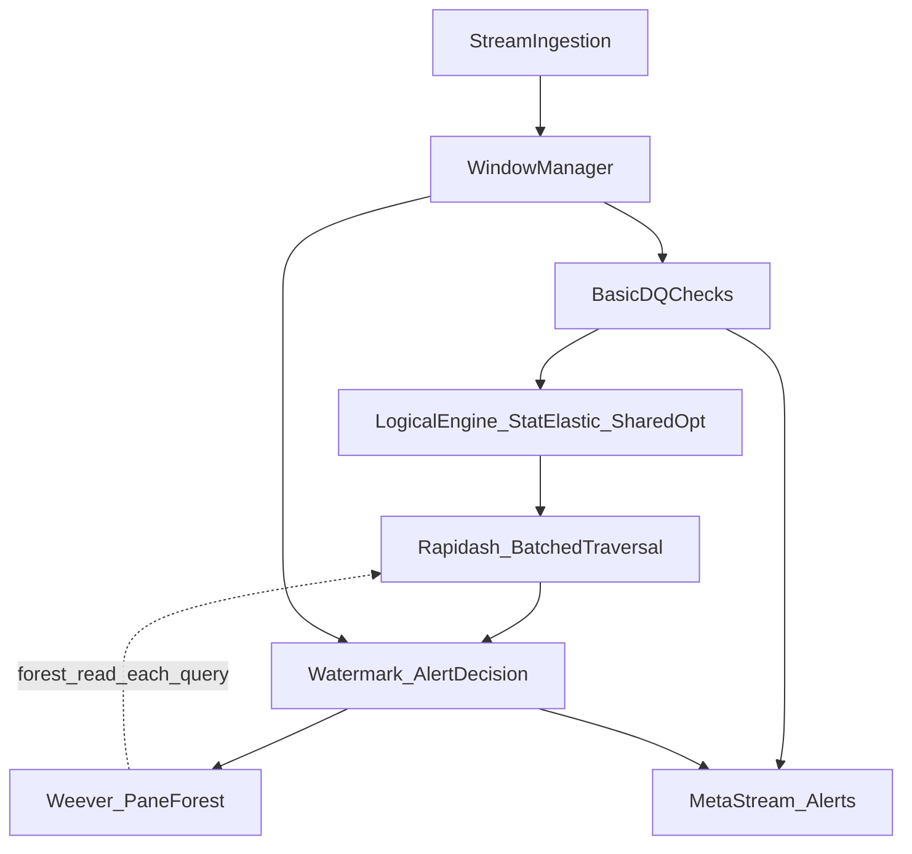

# WAVES — Master checklist cho agent

Checklist end-to-end từ khởi tạo dự án đến bàn giao sản phẩm, thực nghiệm, paper và phản biện. Bám [AGENTS.md](../AGENTS.md), [docs/design/](design/) và [docs/base/](base/). Tick `- [ ]` → `- [x]` khi hoàn thành.

---

## Mục lục

1. [Khởi tạo và quản trị](#0-khởi-tạo-và-quản-trị-dự-án)
2. [Traceability: RQ → thiết kế → metric](#1-traceability-rq--thiết-kế--metric--baseline)
3. [Implementation theo kiến trúc / module](#2-implementation-theo-kiến-trúc--module)
4. [Dữ liệu, ground truth, pipeline benchmark](#3-dữ-liệu-ground-truth-pipeline-benchmark)
5. [Thực nghiệm, metric, baseline/ablation](#4-thực-nghiệm-metric-baselineablation)
6. [Hoàn thiện paper và phản biện](#5-hoàn-thiện-paper-và-phản-biện)
7. [Đóng dự án và tái hiện (reproducibility)](#6-đóng-dự-án-và-tái-hiện-reproducibility)
8. [Tham chiếu tài liệu](#7-tham-chiếu-tài-liệu-gốc)

---

## 0. Khởi tạo và quản trị dự án

### 0.1 Hub tài liệu (bắt buộc theo AGENTS.md)

- [ ] Có [docs/context.md](context.md): hub tổng quan (link tới design, base, mã WAVES, paper).
- [ ] Có [docs/project.md](project.md): milestone, mọi thay đổi đáng kể được ghi nhận.
- [ ] Mỗi lần merge milestone hoặc đổi kiến trúc: cập nhật `context.md` / `project.md`.

### 0.2 Môi trường Python

- [ ] Virtualenv tại `.venv/` (không commit).
- [ ] Dependencies qua `pyproject.toml` của package (ví dụ `WAVES/pyproject.toml`); cài editable: `pip install -e .` trong thư mục package.
- [ ] Không hardcode absolute path trong script/config; dùng `pathlib` / `os.path.join`.

### 0.3 Git và chất lượng kho mã

- [ ] `.gitignore` loại `.venv/`, `__pycache__/`, `.pytest_cache/`, v.v.
- [ ] Nhánh làm việc rõ ràng; tag release khi có bản đo benchmark/paper.
- [ ] Không tự ý xóa file/folder khi chưa được phép bằng văn bản (AGENTS.md).

### 0.4 Nguyên tắc vận hành agent

- [ ] Bị chặn (data, API, credential, build): báo user, không thay bằng pipeline “lite”/mock toàn phần nếu chưa được đồng ý.
- [ ] Quyết định kỹ thuật có cơ sở: code, paper, hoặc tài liệu trong repo.

---

## 1. Traceability: RQ → thiết kế → metric → baseline

Nguồn: [docs/design/thuc_nghiem.docx](design/thuc_nghiem.docx), [docs/design/system_architecture.docx](design/system_architecture.docx), [docs/design/module_specification.docx](design/module_specification.docx).

### 1.1 Bảng Research Questions (bắt buộc đối chiếu khi viết paper / chạy thí nghiệm)

| RQ | Câu hỏi (tóm tắt) | Giả thuyết / cơ chế chính | Metrics chính | Module / block liên quan |
|----|-------------------|---------------------------|---------------|-------------------------|
| RQ1 | Throughput vượt “streaming truyền thống” (nested-loop)? | KD-Tree + pane-based forest, cắt tỉa không gian | Throughput, P99 latency, detection latency | Rapidash layer, Weever (pane forest), Stream input / window |
| RQ2 | EMA + Tombstone/Retraction giữ F1 khi drift + late data? | Elastic box; provisional vs final; retraction | Precision, Recall, F1 (chấm sau retraction) | Statistical Context & Elastic Box; Watermark / Alert Decision; Tombstone |
| RQ3 | Mở rộng khi 50–100 luật DC? | Shared indexing + batched multi-rule | Memory footprint, throughput | Shared Rule Optimizer; Rapidash batched traversal |
| RQ4 | Trade-off siêu tham số? | α EMA, pane size, dimension cap | P99 / avg latency, F1, RAM | Elastic Box; Weever; Shared Rule Optimizer |

- [ ] Bảng trên đã được điền đủ trong báo cáo / readme thực nghiệm.
- [ ] Mỗi thí nghiệm trong chương đánh giá map về đúng một RQ (tránh đánh giá rời rạc).

### 1.2 Luồng tài liệu → code → dữ liệu → paper

- [ ] `docs/design/*` (đặc biệt thuc_nghiem, module_spec, interaction_flow) là nguồn “đúng” cho hành vi mong đợi.
- [ ] Code WAVES có thể trỏ (comment hoặc doc) tới đoạn thiết kế tương ứng.

---

## 2. Implementation theo kiến trúc / module

Nguồn: [system_architecture.docx](design/system_architecture.docx), [module_specification.docx](design/module_specification.docx), [interaction_flow_data_flow.docx](design/interaction_flow_data_flow.docx), [state_time_semantics.docx](design/state_time_semantics.docx).

Mỗi mục dưới đây gồm: **Chức năng**, **Đầu vào**, **Đầu ra**, **Tương tác** (ai gọi ai, thứ tự, điều kiện biên). Thứ tự pipeline tham chiếu luồng “Normal flow” trong interaction doc (event → window → basic checks → statistical context → elastic boxes → batched traversal → decision → weever insert → watermark finalize).

### 2.0 Sơ đồ luồng dữ liệu và phụ thuộc giữa các block

- **Ghi chú phụ thuộc**: **Rapidash** truy vấn **forest** do **Weever** duy trì (cạnh nét đứt: đọc snapshot hiện tại mỗi lần traversal, không sở hữu cây). **Decision** nhận candidate từ Rapidash và watermark; sau đó cập nhật **Weever** (insert/pane) theo interaction doc. **Window Manager** cung cấp ranh giới cửa sổ cho watermark seal và cho Weever khi DROP pane. **Tombstone** (mục 2.9) được duyệt tại lá trong Rapidash và giải phóng theo pane.

---

### 2.1 Stream input / ingestion

- **Chức năng**: Nhận luồng thô (CSV/JSON/Kafka/…), giải mã, gán định danh bản ghi, chuẩn hóa schema tối thiểu để các tầng sau có hai mốc thời gian và khóa nghiệp vụ.
- **Đầu vào**: Raw stream events; cấu hình schema (tên cột event time, ingestion time, khóa dòng).
- **Đầu ra**: `DataEvent` đã chuẩn hóa: ít nhất `EventTime`, `IngestionTime`, khóa định danh, thuộc tính nghiệp vụ cho DC; bản ghi malformed tách riêng (dead-letter / log), không đưa vào window chính.
- **Tương tác**: Chỉ đẩy sự kiện hợp lệ xuống Window Manager. Burst/malformed: backpressure hoặc DLQ theo đặc tả module 5.1 (edge cases). Không dùng IngestionTime để gán window (window theo event-time).

- [ ] Đủ hai mốc thời gian và khóa bản ghi; lỗi parse không làm hỏng toàn pipeline.

---

### 2.2 Window manager (sliding window theo event-time)

- **Chức năng**: Gán mỗi bản ghi vào một hoặc nhiều cửa sổ trượt theo **EventTime**; duy trì buffer cửa sổ đang mở; khi trượt bước `S`, tính delta **insert** (bản ghi mới vào miền) và **delete** (bản ghi rời miền); có thể phát snapshot/delta cho tầng index.
- **Đầu vào**: `DataEvent` đã chuẩn hóa; tham số `W` (độ rộng), `S` (bước trượt); watermark clock (cho ranh giới đóng cửa sổ / seal — phối hợp Decision).
- **Đầu ra**: Luồng “windowed” gồm bản ghi kèm `window_id` / khoảng `[t, t+W)`; sự kiện delta khi slide (tập insert/delete); trạng thái buffer cửa sổ.
- **Tương tác**: Đẩy bản ghi trong cửa sổ tới Basic DQ. Báo cho Weever khi có **slide** (pane hết hạn → DROP pane). **Late data**: vẫn gán đúng cửa sổ quá khứ theo event-time (không vứt bản ghi chỉ vì đến muộn); phối hợp Watermark/Decision cho re-check, không “đóng” vi phạm sai semantics.

- [ ] Quy tắc membership: `t ≤ event_time(R) < t+W` cho cửa sổ bắt đầu `t`.
- [ ] Overlap `W−S` được tính đúng; tránh tính lặp toàn bộ mỗi lần slide nếu có đường incremental (delta).
- [ ] Late / OoO: vẫn route đúng window; chốt alert không do Window Manager một mình mà theo watermark + `wait_for_late`.

---

### 2.3 Basic DQ checks (tầng Stream DaQ)

- **Chức năng**: Kiểm tra chi phí thấp, **theo từng bản ghi** (hoặc aggregate cửa sổ đơn giản): completeness (null), validity (kiểu, regex), range (min/max). Không thực hiện kiểm tra logic chéo nhiều bản ghi tại đây.
- **Đầu vào**: Bản ghi đã gán window (hoặc sắp gán); rule basic (schema, range).
- **Đầu ra**: **Valid Data Events** đi tiếp; **Basic Quality Meta-stream** (thống kê cửa sổ: đếm, tỷ lệ null, v.v.) song song cho giám sát; bản ghi fail có thể lọc hoặc gắn cờ theo chính sách.
- **Tương tác**: Chỉ **Valid** events vào Logical Violation Engine. Meta-stream có thể ghép với đầu ra cuối ở Alert/meta-stream output. Phụ thuộc Window Manager để biết ngữ cảnh cửa sổ khi cần aggregate.

- [ ] Đủ completeness / validity / range trước DC; DC không chạy trên bản ghi đã loại tại basic (trừ khi có quyết định thiết kế rõ).

---

### 2.4 Logical Violation Engine (điều phối) + Statistical Context + Elastic Box

- **Chức năng**: (1) **Statistical Context Engine**: cập nhật online μ, σ² bằng EMA trên các feature ngữ cảnh (vận tốc, duration, … theo từng luật/nhóm). (2) **Elastic Box Generator**: từ bound tĩnh của DC và `Δ = clamp(k·σ, Δ_min, Δ_max)` sinh **ElasticBoundingBox** / ngưỡng động. (3) Điều phối thứ tự: cập nhật thống kê trước, rồi mới materialize box cho evaluation bước kế (tránh event tự làm thay đổi box rồi tự đánh giá trong cùng bước không ổn định).
- **Đầu vào**: Valid events; tập DC tĩnh (hoặc đã qua Shared Rule Optimizer); tham số `α`, `k`, `Δ_min`, `Δ_max`, warm-up; có thể partition key (ví dụ loại xe) cho state theo key.
- **Đầu ra**: Danh sách **ActiveBox** / elastic query region đưa xuống Rapidash (kết hợp output Shared Optimizer); state nhẹ O(1) mỗi key: `μ`, `σ²`/`σ`, `sample_count` warm-up.
- **Tương tác**: Nhận event từ Basic DQ. Đầu ra là đầu vào **Batched Traversal** (cùng index Weever). Phụ thuộc **Shared Rule Optimizer** nếu gom luật: box phải khớp `group_id` / chiều đã pad. Khi **concept drift**, σ tăng → box nới → giảm false positive so với ngưỡng tĩnh (đối chứng Static-Box trong thực nghiệm).

- [ ] Công thức EMA và clamp Δ đúng đặc tả 5.5; cold start / zero variance (`Δ_min > 0`) / spike (`Δ_max`).
- [ ] Key state rõ ràng: `(rule_group, feature)` hoặc tương đương để không lẫn partition.

---

### 2.5 Shared Rule Optimizer

- **Chức năng**: Parse DC thành equality predicates + inequality predicates; **greedy grouping** theo equality signature; hợp không gian bất đẳng thức chung với **`K ≤ K_max`**; **infinite padding** các chiều luật không dùng; tối thiểu hóa số cây / lần duyệt; sinh **ActiveBox** metadata cho runtime (không cần parse lại text DC trên hot path nếu đủ giàu field).
- **Đầu vào**: Tập DC (hoặc ruleset JSON); `K_max`; có thể chạy lại khi đổi ruleset (không nhất thiết mỗi event).
- **Đầu ra**: `List<ActiveBox>`: `group_id`, `rule_id`, `equality_signature`, `active_dimensions`, `padded_bounds`, mapping cột → chiều, `priority`/version ruleset.
- **Tương tác**: Thức ăn cho **Rapidash** (chọn đúng KD-tree theo `group_id`) và cho **Weever** (số không gian / partition). Quá gộp → curse of dimensionality; tách nhóm khi vượt `K_max`.

- [ ] Greedy grouping + cost-aware packing theo đặc tả 5.6; đủ field để Rapidash không parse lại DC trên đường nóng.

---

### 2.6 Rapidash layer (Batched Traversal / Box Dropping)

- **Chức năng**: Biến điều kiện DC thành truy vấn phạm vi trực giao; dùng **KD-tree** (và hash cho equality) để tìm **candidate violations**; **BatchedTraversal**: mang theo nhiều ActiveBoxes, tại mỗi nút **rụng** hộp không giao cắt vùng con (Box Dropping); ở lá, kiểm tra điểm trong box và **TombstoneFilter** trước khi emit. Module **stateless** về chỉ mục: không sở hữu cây lâu dài, chỉ đọc forest do Weever cung cấp.
- **Đầu vào**: Bản ghi đang xét (mới hoặc late); chỉ mục hiện tại (roots / pane list từ Weever); ActiveBoxes; TombstoneFilter (theo pane); ràng buộc DC đã biểu diễn không gian.
- **Đầu ra**: **Candidate violations**: cặp/tập bản ghi + `rule_id` + `window_id` + giải thích ngắn; không phải final alert.
- **Tương tác**: Gọi sau Logical Engine (đã có box). Kết quả gửi **Watermark/Decision** để provisional. **Không** gộp candidate = kết luận cuối. Phụ thuộc **Weever** cho cấu trúc cây; phụ thuộc **Tombstone** để bỏ qua bản ghi đã retract/ghost.

- [ ] Equality qua partition/hash; inequality qua KD / range; candidate-only semantics.
- [ ] BatchedTraversal: cắt nhánh khi `ActiveBoxes` rỗng; lá kiểm tombstone trước khi thêm violation.

---

### 2.7 Weever — Pane-based forest (incremental maintenance)

- **Chức năng**: Chia cửa sổ thành các **pane** (lát thời gian); mỗi pane một KD-tree gần **tĩnh** (bulk-load); **insert** bản ghi mới vào cây của **active pane**; khi slide, **không** xóa từng lá — **DROP** nguyên pane cũ nhất O(1) và tombstone filter gắn pane đó; phát tín hiệu `pane-ready` / đồng bộ nếu cần.
- **Đầu vào**: Lệnh trượt cửa sổ + bản ghi mới; tham số kích pane; từ Window Manager: tập expired / pane boundary.
- **Đầu ra**: Trạng thái **pane-based forest** (danh sách cây theo thời gian) cho Rapidash truy vấn; giải phóng bộ nhớ pane + tombstone cùng lúc khi DROP.
- **Tương tác**: **Rapidash** chỉ đọc forest hiện tại. **Window slide flow** trong interaction doc: Weever DROP pane cũ khi watermark/ranh giới slide; đồng bộ với **Tombstone** (drop filter theo pane). Insert xảy ra sau khi đã có candidate/decision theo thứ tự flow đã chọn (đồng bộ với implementation: giữ đúng pseudo “insert sau decision” trong normal flow hoặc thứ tự đã chốt trong code — miễn không mâu thuẫn late/re-check).

- [ ] Insert chỉ active pane; expire = DROP cả pane; không rebuild pane đã đóng băng.

---

### 2.8 Watermark / Alert Decision Layer

- **Chức năng**: Duy trì **Alert State Store** (KV): pending violations, provisional alerts; theo **Watermark Clock**; tạo **provisional alert** khi có candidate đủ mạnh; **final** khi watermark vượt ngưỡng an toàn (ví dụ sau `window_end + wait_for_late` — khớp cấu hình); **retract** provisional khi late flow chứng minh cảnh báo tạm sai; emit **Retraction Alert**; cleanup TTL sau finalize để không rò RAM.
- **Đầu vào**: Candidate violations từ Rapidash; watermark hiện tại; `wait_for_late`; mapping window ↔ alert id; sự kiện late từ luồng xử lý muộn.
- **Đầu ra**: Ba loại sự kiện: **Provisional**, **Final**, **Retraction**; cập nhật store; lệnh tombstone khi retract (phối hợp TombstoneFilter).
- **Tương tác**: Đọc watermark từ pipeline (ingestion/event-time policy đã thống nhất). **Không** chặn toàn luồng xử lý chỉ để chờ — provisional cho phép phản ứng sớm; final cho tính nhất quán. Phối hợp **Window Manager** khi seal cửa sổ. Late flow: tìm alert cũ → tombstone record nguồn → emit retraction → (tùy thiết kế) re-route event qua Basic → Logical → Rapidash.

- [ ] Phân biệt rõ provisional vs final; cleanup store sau finalize/retract.
- [ ] Điều kiện final thống nhất với state_time_semantics (watermark vs allowed lateness).
- [ ] Đảm bảo **Tombstone state** (nếu quản lý tách ở tầng Decision) và **Alert State Store** được giải phóng bộ nhớ (garbage-collect entry theo cửa sổ, TTL, hoặc xóa rõ ràng) **ngay sau khi cửa sổ đã Finalize** — streaming 24/7 dễ để lại KV cũ gây memory leak nếu chỉ “đánh dấu final” mà không dọn store.

---

### 2.9 Tombstone Filter (theo pane)

- **Chức năng**: Lưu id bản ghi đã vô hiệu hóa (retract, lỗi, late đã xử lý) để **BatchedTraversal** bỏ qua lá với chi phí ~O(1) (Bloom/Cuckoo theo đặc tả state doc); **cấp phát theo pane**, drop cùng pane khi slide.
- **Đầu vào**: Lệnh `add(id)` từ Decision khi retract; ranh giới pane drop từ Weever.
- **Đầu ra**: `contains(id)` cho tầng duyệt lá.
- **Tương tác**: Chỉ dùng sau khi Decision phát retraction; **Rapidash** đọc khi duyệt; **Weever** giải phóng filter cũ với pane.

- [ ] Không để tombstone phình vô hạn: gắn vòng đời với pane/window.
- [ ] Cài đặt cấu trúc tombstone bằng **Cuckoo Filter** (hoặc cấu trúc tương đương tra cứu ~O(1)) hoặc **Set** với membership O(1) kỳ vọng; **gắn tham chiếu** tới **ID pane** (hoặc handle chung) tương ứng để khi **DROP pane** thì giải phóng filter đó cùng lúc — tránh orphan tombstone.

---

### 2.10 Luồng Late data và Retraction (HandleLateEvent)

- **Chức năng**: Khi `R_late` vẫn trong ngưỡng lateness: chèn vào cửa sổ quá khứ; **re-check** candidate; nếu làm sai provisional cũ → tombstone + retraction; chuẩn hóa event và chạy lại nhánh Basic → Logical → Rapidash nếu cần; cập nhật Weever (insert late vào đúng pane/window semantics).
- **Đầu vào**: LateEvent; AlertStateStore; TombstoneFilter; pipeline con.
- **Đầu ra**: Retraction events; provisional/final mới; index/cửa sổ nhất quán.
- **Tương tác**: Chỉ nơi **hủy** provisional (ngoài watermark finalize). Khớp pseudo **HandleLateEvent** / **BatchedTraversal** trong interaction doc.

- [ ] Thứ tự: tìm alert liên quan → tombstone + emit retraction → normalize → window/basic/logical/rapidash → upsert store → weever insert.

---

### 2.11 Alert / meta-stream output

- **Chức năng**: Đóng gói **quality meta-stream** (basic stats + có thể cờ chất lượng cửa sổ) và **violation alert stream** (provisional / final / retraction) ra sink (file, Kafka, callback) thống nhất schema.
- **Đầu vào**: Output Basic DQ; quyết định từ Decision; metadata window/rule.
- **Đầu ra**: Luồng quan sát downstream; schema version để tái lập thí nghiệm.
- **Tương tác**: Mọi metric **detection latency** và **F1 sau retraction** đo trên luồng này kết hợp ground truth.

- [ ] Schema rõ: loại sự kiện (meta vs alert vs retract), `window_id`, `rule_id`, timestamps.

---

### 2.12 Kiểm chứng “done” cho từng module

- [ ] Mỗi khối 2.1–2.11 có ít nhất một test hoặc script demo chứng minh đúng I/O và một tương tác biên (ví dụ một late event, một slide pane).
- [ ] Ghi nhận trong [docs/project.md](project.md): module, ngày, link test/demo.

---

## 3. Dữ liệu, ground truth, pipeline benchmark

Nguồn: [thuc_nghiem.docx](design/thuc_nghiem.docx) (mục 3, 3.6, 8.1); tham chiếu polluter: [Icewafl_context.md](base/Icewafl_context.md).

### 3.1 Tập nền

- [ ] Nguồn: NYC Taxi Yellow Cab; định dạng CSV hoặc Parquet.
- [ ] Trường ưu tiên: pickup/dropoff time, PULocationID, DOLocationID, trip_distance, fare_amount, total_amount, trip_duration, tolls_amount, RatecodeID.
- [ ] B1 — Base prep: đọc gốc, loại lỗi vật lý hiển nhiên, chuẩn hóa schema → tập nền sạch.

### 3.2 Ground truth (không có sẵn từ dữ liệu tự nhiên)

- [ ] Ground truth vi phạm logic do pipeline tiêm có kiểm soát (tỷ lệ nhỏ bản ghi), biết rõ bản ghi/loại lỗi/thời điểm.

### 3.3 Module tiêm nhiễu (theo thực nghiệm)

- [ ] **Tiêm vi phạm logic**: mutate fare / distance / duration (pattern: Fare Inflation, Time–Distance Anomaly, Distance Collapse) phục vụ Precision/Recall/F1.
- [ ] **Concept drift**: ví dụ tăng trip_duration đồng loạt trong khung giờ cao điểm (kẹt xe / bão tuyết) để kiểm EMA.
- [ ] **Late & OoO**: hai mốc EventTime và IngestionTime; ~90% on-time; ~10% late 120–300s; sắp xếp phát theo IngestionTime; một phần late dùng làm đối chứng retraction.
- [ ] **Thứ tự khi prep dạng bảng (Pandas/PySpark)**: thực hiện **`sort` toàn bộ DataFrame theo `IngestionTime` ở bước cuối cùng** trước khi đưa vào luồng phát/replay — để thứ tự sự kiện vào hệ thống khớp ingestion **và** vẫn tạo được hiện tượng **out-of-order theo event-time** một cách tự nhiên (event-time ≠ thứ tự phát).

### 3.4 Chuỗi B2–B4 (sau B1)

- [ ] B2 — Concept drift injection → tập có drift.
- [ ] B3 — Logical fraud injection (DC1/DC2/DC3 trên tỷ lệ nhỏ) → ground truth positives.
- [ ] B4 — Late-data injection → luồng benchmark cuối (event time + ingestion time + cờ).

### 3.5 Artefact dữ liệu

- [ ] File benchmark: nhãn ground truth, event time, ingestion time, cờ loại nhiễu.
- [ ] Script prep: Python + Pandas hoặc PySpark (theo khuyến nghị 8.1); có thể thêm Kafka producer replay (optional).

### 3.6 Icewafl và các công cụ ngoài

- [ ] Icewafl dùng làm tham chiếu polluter/benchmark stream (paper EDBT 2025); không thay thế im lặng bộ dữ liệu NYC + injection đã chốt nếu chưa có quyết định bằng văn bản.

---

## 4. Thực nghiệm, metric, baseline/ablation

Nguồn: [thuc_nghiem.docx](design/thuc_nghiem.docx) (mục 4–7, 9, 10, phụ lục).

### 4.1 Luật logic benchmark (DC1–DC3)

- [ ] **DC1 — Fare–Distance Dominance**: hai xe quãng đường gần nhau → xe ngắn không fare cao bất thường (Rapidash/KD-Tree).
- [ ] **DC2 — Context-Aware Duration Anomaly**: chuyến tương đồng không chênh duration quá lớn ngoài biên độ ngữ cảnh (EMA).
- [ ] **DC3 — Toll Route Anomaly**: cùng tuyến không lệch toll bất thường (shared indexing / multi-rule).

### 4.2 Baselines / ablation (công bằng parser/runtime)

| Hệ thống | KD-Tree | Pane forest | EMA | Retraction | Mục đích |
|----------|---------|-------------|-----|------------|----------|
| NL-Stream | ✗ | ✗ | ✗ | ✗ | O(N²), chứng minh nút thắt |
| Single-Tree-DaQ | ✓ | ✗ | ✗ | ✗ | Một cây lớn → fragment/spike |
| Static-Box-DaQ | ✓ | ✓ | ✗ | ✓ | Drift → false positive |
| WAVES-SingleRule | ✓ | ✓ | ✓ | ✓ | Tắt shared optimizer — nhiều cây rời |
| Buffer-Wait-DaQ | ✓ | ✓ | ✓ | ✗ | Detection latency cao (chờ watermark) |
| WAVES-Full | ✓ | ✓ | ✓ | ✓ | Cấu hình đầy đủ |

- [ ] Mỗi baseline có cấu hình và log chạy có thể tái lập.
- [ ] Giải thích ngắn baseline nào trả lời RQ nào (thuc_nghiem mục 5.1).

### 4.3 Metrics hệ thống

- [ ] Throughput (events/s).
- [ ] P99 latency (và avg nếu cần sensitivity).
- [ ] Detection latency (event time → khi alert “nhìn thấy”).
- [ ] Memory footprint (RAM khi chạy dài / khi tăng số luật).

### 4.4 Metrics độ chính xác

- [ ] Precision, Recall, F1 trên vi phạm logic (so ground truth).
- [ ] Quy tắc streaming có retraction: không chốt PR chỉ trên provisional [+1]; tính trạng thái sau khi cộng/trừ retraction [-1] (Tombstone Filter).

### 4.5 Sensitivity analysis (E1–E3)

- [ ] **E1 — Pane size**: cửa sổ cố định (ví dụ 10 phút); đo P99, avg latency.
- [ ] **E2 — α (EMA)**: trên tập có drift; Precision, Recall, F1.
- [ ] **E3 — Shared indexing dimension cap**: với ~100 luật DC; RAM, throughput.

### 4.6 Quy trình E2E bốn pha

- [ ] Pha 1: Chuẩn bị dữ liệu + benchmark stream (dataset + ground truth + timestamps).
- [ ] Pha 2: Chạy toàn bộ baselines + WAVES-Full cùng phần cứng/cấu hình.
- [ ] Pha 3: Tổng hợp theo RQ — bảng, biểu đồ, diễn giải.
- [ ] Pha 4: Sensitivity — đồ thị trade-off, cấu hình khuyến nghị.

### 4.7 Kỳ vọng kết quả theo RQ (mục 9 thuc_nghiem)

- [ ] RQ1: Throughput cao hơn NL-Stream; P99 ổn định hơn Single-Tree.
- [ ] RQ2: Precision/F1 cao hơn Static-Box và Buffer-Wait khi drift + late; detection latency thấp hơn Buffer-Wait.
- [ ] RQ3: RAM tăng chậm; throughput không sụp khi 50–100 luật (so WAVES-SingleRule).
- [ ] RQ4: Vùng tham số tối ưu thấy trên đồ sensitivity (không một cực trị duy nhất tùy tiện).

### 4.8 Artefact thí nghiệm cho paper

- [ ] Log runtime, metrics thô, alert streams.
- [ ] Biểu đồ gợi ý (phụ lục A thuc_nghiem): throughput vs window size; P99 theo thời gian; PR/F1 drift; detection latency; RAM/throughput vs số luật; đường sensitivity α / pane / dimension cap.

---

## 5. Hoàn thiện paper và phản biện

### 5.1 Checklist chương thực nghiệm (mục 10 thuc_nghiem)

- [ ] Bốn RQ và mapping thí nghiệm rõ ràng.
- [ ] Pipeline tiêm nhiễu + ground truth có kiểm soát.
- [ ] Baselines/ablation đầy đủ và công bằng.
- [ ] Metrics system + accuracy đầy đủ; quy tắc chấm với retraction.
- [ ] Sensitivity analysis cho siêu tham số chính.
- [ ] Artefact: logs, alert streams, bảng, đồ thị.
- [ ] Diễn giải theo từng RQ (không liệt kê rời rạc).

### 5.2 Phạm vi bài toán (problem statement)

- [ ] Đầu vào/ra và ranh giới khớp [problem_statement&scope.docx](design/problem_statement&scope.docx) (không lạm phạm UI, batch analytics dài hạn nếu không nằm trong scope đã chốt).

### 5.3 Phản biện kiến trúc

- [ ] Luyện theo [cauhoi.docx](design/cauhoi.docx): O(N²) vs KD-Tree; pane vs một cây; EMA vs ngưỡng tĩnh; shared indexing; tombstone vs chỉ chờ watermark; watermark không chặn toàn luồng nếu thiết kế provisional + final đúng.

### 5.4 Optional related work

- [ ] Nếu cần: liên hệ bài “false DC discovery” (ví dụ nội dung tóm tắt trong `total.txt` ở root repo) → phần limitation/future work (không bắt buộc trùng scope implementation).

---

## 6. Đóng dự án và tái hiện (reproducibility)

- [ ] Tag release trùng bản dùng cho paper.
- [ ] Ghi commit hash, seed ngẫu nhiên (nếu có), ruleset/config JSON, phiên bản Python và dependency chính.
- [ ] Gói artifact: dữ liệu benchmark đã chốt (hoặc script tải + hash), log, figure.
- [ ] Cập nhật lần cuối [docs/project.md](project.md) và mục “hoàn thành” trong checklist này.

---

## 7. Tham chiếu tài liệu gốc

| Tài liệu | Đường dẫn |
|----------|-----------|
| Đánh giá thực nghiệm, RQ, DC, baseline, metrics | [docs/design/thuc_nghiem.docx](design/thuc_nghiem.docx) |
| Problem statement / scope | [docs/design/problem_statement&scope.docx](design/problem_statement&scope.docx) |
| Kiến trúc hệ thống | [docs/design/system_architecture.docx](design/system_architecture.docx) |
| Đặc tả module | [docs/design/module_specification.docx](design/module_specification.docx) |
| Interaction / data flow | [docs/design/interaction_flow_data_flow.docx](design/interaction_flow_data_flow.docx) |
| State & time semantics | [docs/design/state_time_semantics.docx](design/state_time_semantics.docx) |
| Câu hỏi phản biện | [docs/design/cauhoi.docx](design/cauhoi.docx) |
| Stream DaQ | [docs/base/stream-DaQ_context.md](base/stream-DaQ_context.md) |
| Rapidash | [docs/base/Rapidash_context.md](base/Rapidash_context.md) |
| Weever | [docs/base/Weever_context.md](base/Weever_context.md) |
| Icewafl | [docs/base/Icewafl_context.md](base/Icewafl_context.md) |
| Quy tắc agent repo | [AGENTS.md](../AGENTS.md) |

---

*Phiên bản checklist bám plan “Master checklist cho agent WAVES” và nội dung design trong `docs/`.*
