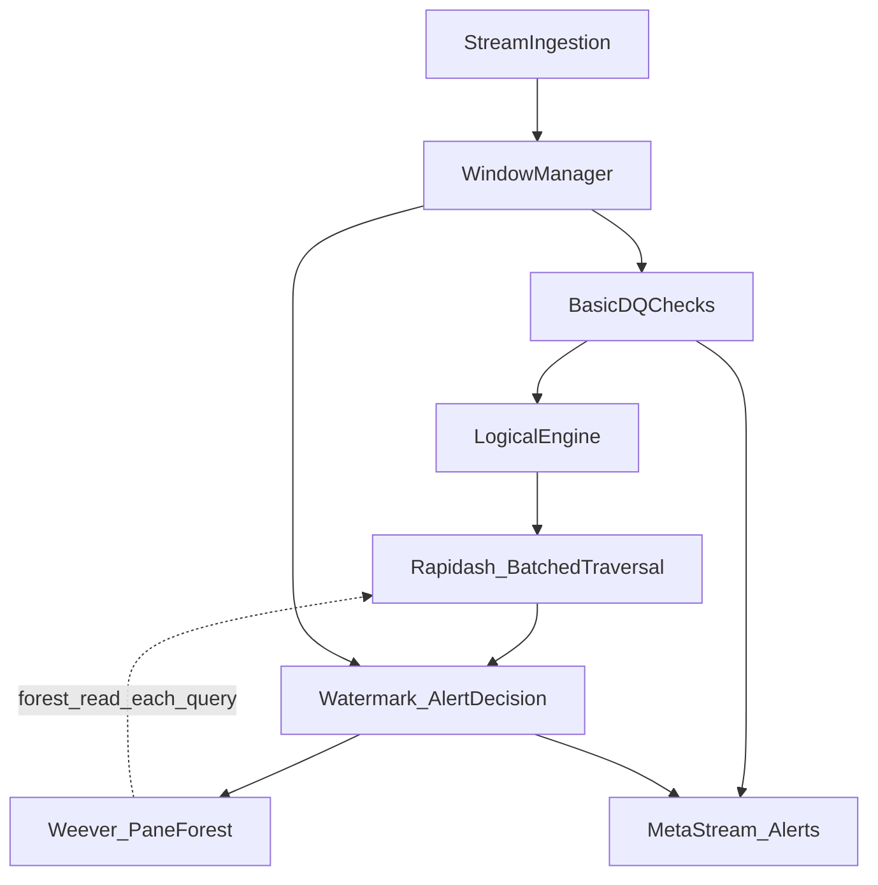

# WAVES — Context Hub

> Hub tổng quan dự án. Link đến design docs, base context, cấu trúc code.

---

## Tài liệu thiết kế (docs/design/)

| Tài liệu | Mô tả |
|-----------|--------|
| [system_architecture.docx](design/system_architecture.docx) | Kiến trúc tổng thể 8 block |
| [module_specification.docx](design/module_specification.docx) | Đặc tả chi tiết 4 module lõi |
| [interaction_flow_data_flow.docx](design/interaction_flow_data_flow.docx) | Luồng tương tác + pseudocode |
| [state_time_semantics.docx](design/state_time_semantics.docx) | Ngữ nghĩa thời gian, state lifecycle |
| [thuc_nghiem.docx](design/thuc_nghiem.docx) | Thiết kế benchmark, RQ, DC, baselines |
| [problem_statement&scope.docx](design/problem_statement&scope.docx) | Bài toán, mục tiêu, phạm vi |
| [cauhoi.docx](design/cauhoi.docx) | Bộ câu hỏi phản biện |
| [extracted_content.txt](design/extracted_content.txt) | Nội dung trích xuất từ docx |
| [baseline_benchmark_plan.md](baseline_benchmark_plan.md) | Kế hoạch benchmark để so trực tiếp với Ada-Context và benchmark phụ của WAVES |

## Base Projects (docs/base/)

| Dự án | Nguồn | Vai trò trong WAVES |
|-------|-------|----------------------|
| [stream-DaQ_context.md](base/stream-DaQ_context.md) | base_repo/stream-DaQ | StreamDaQ gốc: windowing, basic DQ, Pathway integration |
| [Rapidash_context.md](base/Rapidash_context.md) | base_repo/Rapidash | KD-Tree, Box Dropping, DCVerifier pattern |
| [Weever_context.md](base/Weever_context.md) | base_repo/Weever | Pane-based forest, LT-Tree, O(1) DROP |
| [Icewafl_context.md](base/Icewafl_context.md) | base_repo/Icewafl | Data injection pipeline (Flink→Pathway adaptation) |

|## Benchmark Research

**File:** [benchmark_research.md](../benchmark_research.md)

> Comprehensive survey of 36+ systems, 44 key papers (VLDB/SIGMOD/ICDE/EDBT/ICML 2013–2025) related to WAVES competitive landscape.

**Key Finding:** No system in 36+ surveyed systems measures Precision/Recall/F1 on stream DC violations — this is WAVES's primary contribution.

**Top Metrics (Tier 1 — WHITE SPACE):** F1 Score (no drift, with drift, with late data), Retraction Rate, Precision/Recall

**Top Papers:** Rapidash (2023), StreamDaQ (2025), False DC Discovery (2025), CPOD (2021), NAB (2015), FiBA (2019), SODA (2023), SWIX (2024)

**Recommended Claims:** "First system to measure F1/Precision/Recall on stream DC violations" — verifiable from literature survey.

## Cấu trúc Code (WAVES/)

```
WAVES/
├── waves/
│   ├── ingestion/          # 2.1 StreamIngestion
│   ├── windowing/          # 2.2 WindowManager  [Pane định nghĩa DUY NHẤT tại đây]
│   ├── basic_dq/          # 2.3 BasicDQChecks
│   ├── logical_engine/     # 2.4 LogicalEngine   [GỘP 1 file]
│   ├── optimizer/          # 2.5 SharedRuleOptimizer
│   ├── rapidash/           # 2.6 Rapidash
│   ├── weever/             # 2.7 Weever
│   ├── decision/           # 2.8 Watermark/AlertDecision
│   ├── tombstone/          # 2.9 TombstoneFilter
│   ├── late_handler/       # 2.10 LateDataHandler
│   ├── output/             # 2.11 Alert/MetaStreamOutput
│   └── store/              # 2.11b EventStore (SHARED)
├── configs/
│   ├── dc_rules.json       # DC1, DC2, DC3
│   └── system.yaml         # System-wide config
├── scripts/
│   ├── prepare_benchmark.py # B1: NYC Taxi base prep
│   ├── inject_fraud.py      # B3: DC1–DC3 injection
│   ├── inject_drift.py      # B2: Concept drift
│   ├── inject_late.py       # B4: Late/OoO injection
│   └── run_baseline.py      # Baseline runners
├── examples/                # Demo scripts per module
└── tests/                   # Unit + integration tests
```

## Kiến trúc luồng dữ liệu



**Phụ thuộc cần lưu ý:**
- Rapidash đọc snapshot forest từ Weever (stateless về index)
- Decision nhận candidate từ Rapidash + watermark → cập nhật Weever
- WindowManager cung cấp ranh giới cho watermark seal và cho Weever khi DROP pane
- TombstoneManager khởi tạo tại pipeline level, truyền vào Decision và Weever
- EventStore là SHARED instance, truyền vào mọi module

## Research Questions

| RQ | Câu hỏi | Modules |
|----|----------|---------|
| RQ1 | Throughput vượt nested-loop? | Rapidash, Weever, Ingestion, Window |
| RQ2 | EMA + Tombstone/Retraction giữ F1 khi drift + late? | LogicalEngine, ElasticBox, Decision, Tombstone |
| RQ3 | Mở rộng khi 50–100 luật? | SharedRuleOptimizer, Rapidash batched |
| RQ4 | Trade-off siêu tham số? | ElasticBox, Weever, SharedRuleOptimizer |

## Baseline Systems

| Hệ thống | KD-Tree | Pane | EMA | Retraction |
|-----------|---------|------|-----|------------|
| NL-Stream | ✗ | ✗ | ✗ | ✗ |
| Single-Tree-DaQ | ✓ | ✗ | ✗ | ✗ |
| Static-Box-DaQ | ✓ | ✓ | ✗ | ✓ |
| WAVES-SingleRule | ✓ | ✓ | ✓ | ✓ |
| Buffer-Wait-DaQ | ✓ | ✓ | ✓ | ✗ |
| WAVES-Full | ✓ | ✓ | ✓ | ✓ |

## DC Logic (DC1–DC3)

- **DC1**: Fare–Distance Dominance
- **DC2**: Context-Aware Duration Anomaly
- **DC3**: Toll Route Anomaly

## Thứ tự ưu tiên đọc source

1. `[original]stream-DaQ/streamdaq/` — Stream DaQ gốc (không sửa)
2. `WAVES/waves/` — Code đang phát triển
3. `base_repo/Rapidash/` — DC Checking reference
4. `base_repo/Weever/` — Incremental indexing reference

## Checklist

Xem [MASTER_AGENT_CHECKLIST.md](MASTER_AGENT_CHECKLIST.md) — blueprint tổng hợp cho toàn bộ implementation.
